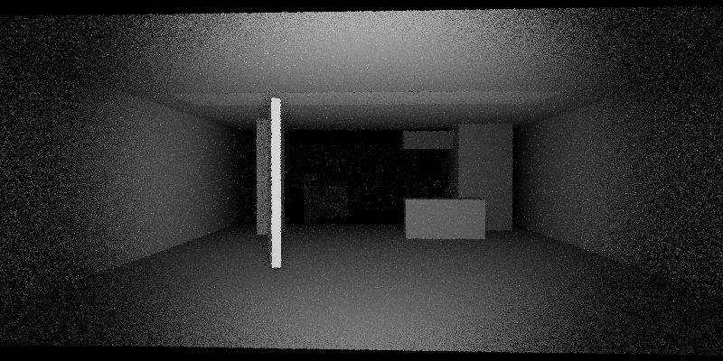

# Liminal Raytraced-World LLM-Built Game



## About

This repository is a native, local-first interactive fiction and raytracing research prototype. It asks what happens when most of a game's computational budget is spent on language inference, interpretation, and world structure while a deliberately constrained CPU raytracer produces the image.

The active artistic direction follows a four-stage lineage from Lovecraft and Kenneth J. Sterling's *In the Walls of Eryx*, through ASD's *Beyond the Walls of Eryx* and Mandarine's *Within the Mesh*, to an interactive generative labyrinth. The intended player explores Venusian extraction infrastructure while an invisible topology can change through LLM proposals validated by an authoritative engine.

The first playable Eryx slice is now present: seven canonical quarry locations, active Eryx prompts and state labels, a typed invisible barrier, and an authored impossible return. Live LLM topology proposals and their validator remain planned. The historical datacenter fixtures and legacy helper name are preserved as technical baselines. See [`documentation/ERYX_PLAYABLE_SPATIAL_ROADMAP.md`](documentation/ERYX_PLAYABLE_SPATIAL_ROADMAP.md) for the route and [`documentation/TECHNICAL_STATE.md`](documentation/TECHNICAL_STATE.md) for the exact implementation boundary.

Current state:

- vendored Cornell Box assets
- vendored `llama.cpp` tree in `vendor/llama.cpp`
- clean C++11 CLI renderer
- proprietary scene format v1 bootstrap
- source-generated Eryx quarry prefab vocabulary and visual catalog
- first handcrafted liminal scene
- camera-attached parametric spotlight for proprietary scenes
- grayscale material reduction from the Cornell MTL
- simple BVH acceleration
- diffuse path tracing with direct light sampling and low-bounce radiosity
- locked dielectric glass for crystal prefabs, with refraction, exact Fresnel reflection, total internal reflection, thickness-dependent RGB filtering, bounded “poor man's” dispersion, and a separate path-depth limit
- native PNG output via vendored `stb_image_write.h`
- optional `llama.cpp` runtime wiring in CMake
- optional OpenMP line-parallel rendering in CMake
- first SDL3 interactive frontend with streaming LLM output
- first generated-room graph for improvised cardinal navigation
- authoritative hard/soft/spatial state with deterministic and hybrid scene compilation
- seven-place Eryx survey route with deterministic invisible contact and non-reciprocal traversal
- legacy datacenter/desert scenes retained as historical baselines
- Python helper to download `Ministral 3 8B Instruct 2512` GGUF
- first headless `Ministral` turn pipeline wired to the renderer
- explicit provenance for the reused 2003 raytracer ideas

Documentation index:

- `documentation/README.md`

## Build

```powershell
cmake -S . -B build -G "Visual Studio 17 2022"
cmake --build build --config Release
```

Windows helper:

```bat
build_release.bat
run_cornell_test.bat
download_ministral.bat
ask_ministral.bat
play_desert_des_tokens.bat
```

`play_desert_des_tokens.bat` retains the previous working title as a legacy runtime name. No final replacement title has been selected.

If you want the vendorized `llama.cpp` build with CUDA enabled, keep the default CMake options:

```powershell
cmake -S . -B build -G "Visual Studio 17 2022" -DLIMINAL_ENABLE_LLAMA_CPP=ON -DLIMINAL_ENABLE_LLAMA_CUDA=ON
cmake --build build --config Release
```

SDL3 is now enabled by default too. If the library is not already installed on the machine, CMake fetches SDL `3.4.12` automatically and links it statically for the interactive frontend.

OpenMP is enabled by default when the local compiler supports it. To force a mono-thread build:

```powershell
cmake -S . -B build -G "Visual Studio 17 2022" -DLIMINAL_ENABLE_OPENMP=OFF
cmake --build build --config Release
```

Model download helper:

```powershell
python -m pip install "huggingface_hub<1.0"
python scripts\download_ministral.py
```

Windows shortcut:

```bat
download_ministral.bat
download_ministral.bat --force-download
```

Quick local LLM question:

```bat
ask_ministral.bat "Quel est le sens de la vie ?"
ask_ministral.bat "Resume-moi ce projet en 3 phrases."
```

Launch the SDL3 frontend:

```bat
play_desert_des_tokens.bat
play_desert_des_tokens.bat --location quarry_threshold
play_desert_des_tokens.bat --load-state output\sdl_session_state.json
```

These commands launch the Eryx slice. The helper retains the previous working title until a final title is selected.

## Run

```powershell
.\build\Release\liminal_cornell_renderer.exe
```

Inspect the compiled `llama.cpp` runtime wiring:

```powershell
.\build\Release\liminal_cornell_renderer.exe --llama-info
```

The default run now renders:

- `assets/scenes/liminal_service_corridor.scene`
- en `800x400` par defaut, en cadrage panorama
- avec `16 spp` par defaut

Useful overrides:

```powershell
.\build\Release\liminal_cornell_renderer.exe --scene assets\scenes\liminal_service_corridor.scene --samples 16 --width 256 --height 256
.\build\Release\liminal_cornell_renderer.exe --scene assets\cornell\cornell_box.obj --output output\cornell_box_512.png --samples 64 --width 512 --height 512
.\build\Release\liminal_cornell_renderer.exe --sdl --location quarry_threshold --save-state output\sdl_session_state.json
.\build\Release\liminal_cornell_renderer.exe --dump-turn-contract --location labyrinth_threshold --command "inspect the northern datum"
.\build\Release\liminal_cornell_renderer.exe --compile-location quarry_threshold --output output\compiled_eryx_threshold.png
.\build\Release\liminal_cornell_renderer.exe --run-session --location quarry_threshold --command north --command north --command east --command north --command east --command north --command east --command west --save-state output\eryx_route.json --output output\eryx_route.png
.\build\Release\liminal_cornell_renderer.exe --run-turn --load-state output\eryx_route.json --command west --dump-session-history --output output\eryx_route_2.png
``` 

`--sdl` opens the first desktop loop:

- top panel: raytraced scene
- lower panel: transcript joueur avec la narration finale seulement
- input line: text entry with edition, history on arrow up/down, submit on Enter
- status line with ASCII spinner for `llm` and `cpu`
- raw LLM output and generated `.scene` stream to the terminal, not to the player GUI
- `Escape` while busy: cancellation request
- cardinal commands like `NORTH`, `EAST`, `SOUTH`, `WEST` can now generate and cache improvised rooms on first entry

Default output: `output/liminal_service_corridor.png`

Cornell Box test helper:

```bat
run_cornell_test.bat
```
