# Ambiance: Incomplete but Operational Space

Last updated: 2026-08-09

## Purpose

This document reads the images in `documentation/moodboard` through the active Eryx direction in [`SPEC.md`](./SPEC.md). It is not a style-shopping list and does not propose a retro filter.

The corpus establishes a contemporary visual grammar for:

- sparse Venusian prospecting and extraction
- quarry and industrial brutalism
- an invisible topology that exceeds the rendered scene
- an instrumented interface shared by text and image
- visible computational limits

The central proposition remains:

> low-fi worlds are incomplete but operational.

They provide enough geometry, language, and interface to support action while leaving the player responsible for reconstructing the larger world.

## Three layers of lineage

### 1. Foundational microcomputer perception

Early games demonstrate that a world can be suggested through sparse geometry, text, interface, direction, and omission. The most useful references include:

- *Driller* and *The Sentinel* for severe geometric space and active emptiness
- *Tau Ceti* and *Midwinter* for instrumented landscape perception
- *The Pawn* for an equal partnership between text and image
- *Captain Blood* for the interface as a perceptual machine
- *Drakkhen* for a minimal exterior carrying disproportionate fictional weight
- parser and windowed adventures for compartmentalized action, text, inventory, and view

These images belong to a personally formative Atari ST and Amiga culture in which games, crack intros, and demos appeared through the same machines and social practices. Their relevance is situated and affective as well as formal.

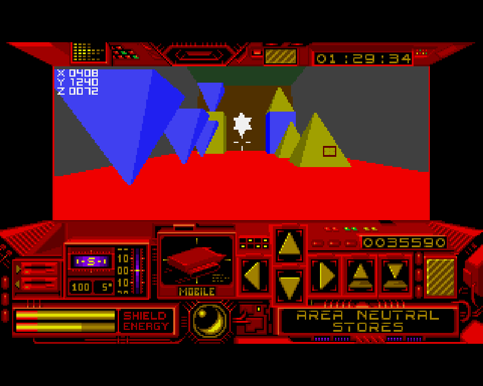

*A few masses and diagonals establish hostility, passage, and the need to infer what lies beyond the current view.*

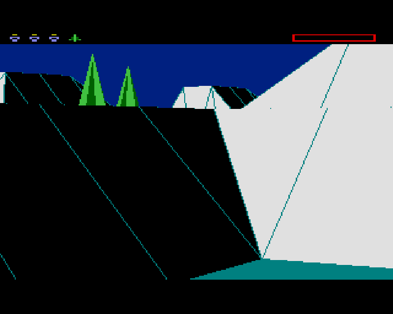

*An almost empty space can remain legible, tense, and mentally active.*


*The world is not presented directly. It is read through an apparatus.*

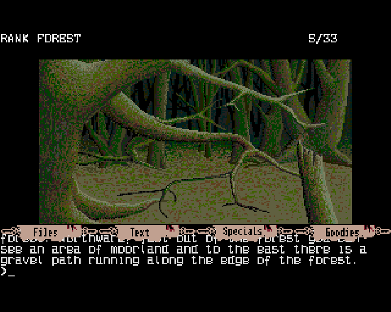

*Text does not merely compensate for the picture, and the picture is not a decorative reward for reading.*

### 2. Demoscene transformation

Demos make computed space itself an event. They do not only depict a world; they foreground projection, transformation, timing, surface, and machine execution.

ASD's [*Beyond the Walls of Eryx*](https://www.pouet.net/prod.php?which=31088) is the central reference for the active project. It transforms the Eryx motif through lines, parallel-projection space, linked worlds, change, collapse, and the breakdown of spatial certainty. It establishes a direct historical route from the literary invisible maze to demoscene computation.

Mandarine's [*Within the Mesh*](https://www.pouet.net/prod.php?which=61730), co-created by the present project's author, is the personal continuation of that route. It makes the genealogy lived rather than decorative.

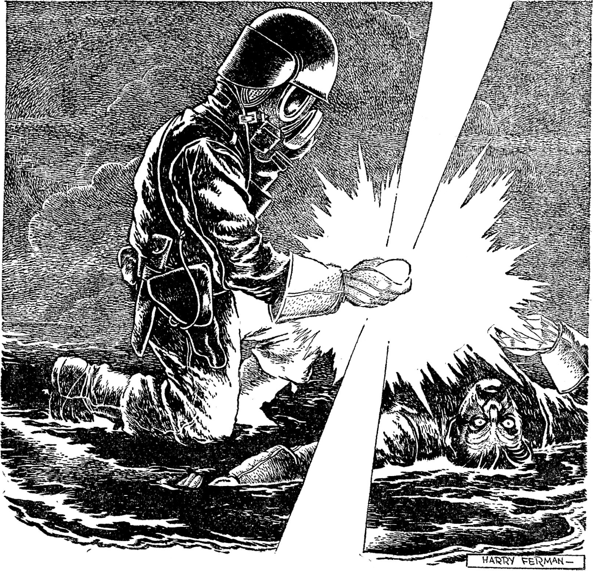

*Harry Ferman's illustration makes the originating perceptual problem immediately legible: bodily contact asserts a plane that ordinary sight cannot verify. The current work transfers this gap from illustration into traversal.*

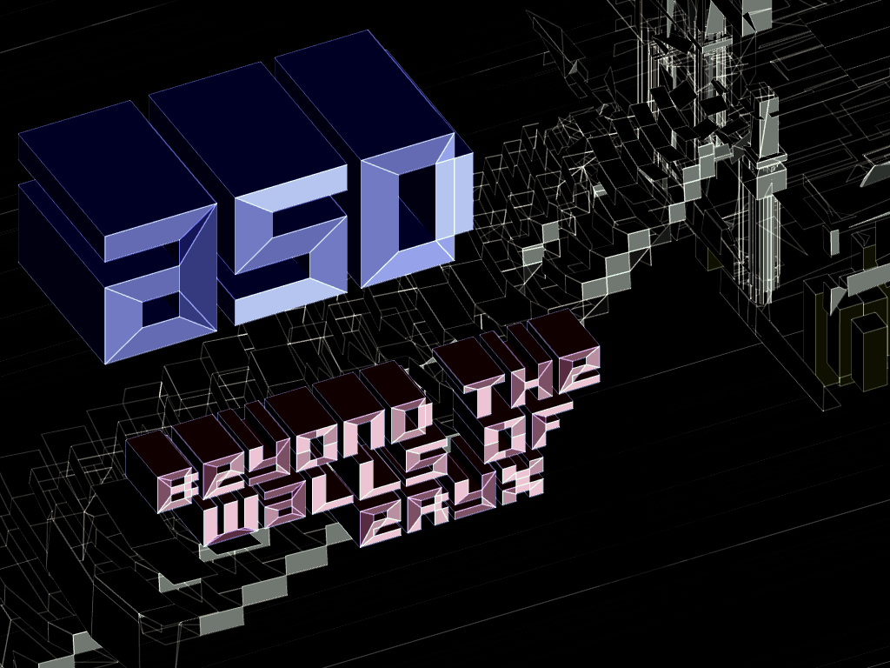

*ASD turns Eryx into a visibly computed field. Solid lettering and sparse surfaces sit inside a much larger proliferating wire structure, making representation and underlying construction coexist.*

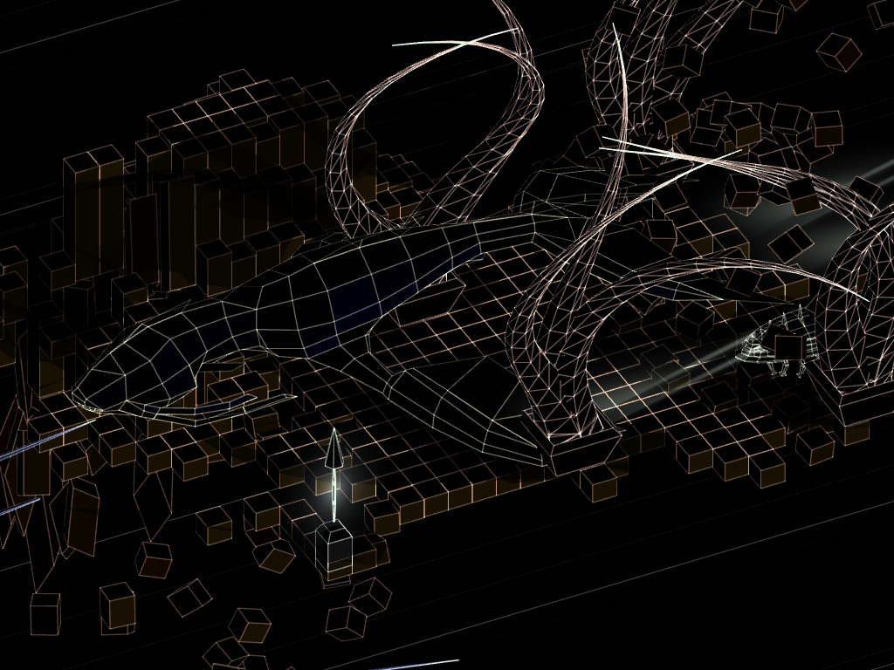

*Curves, grids, blocks, and fragments deny a single stable spatial register. The useful inheritance is transformation of computed space itself, not any one object or palette.*

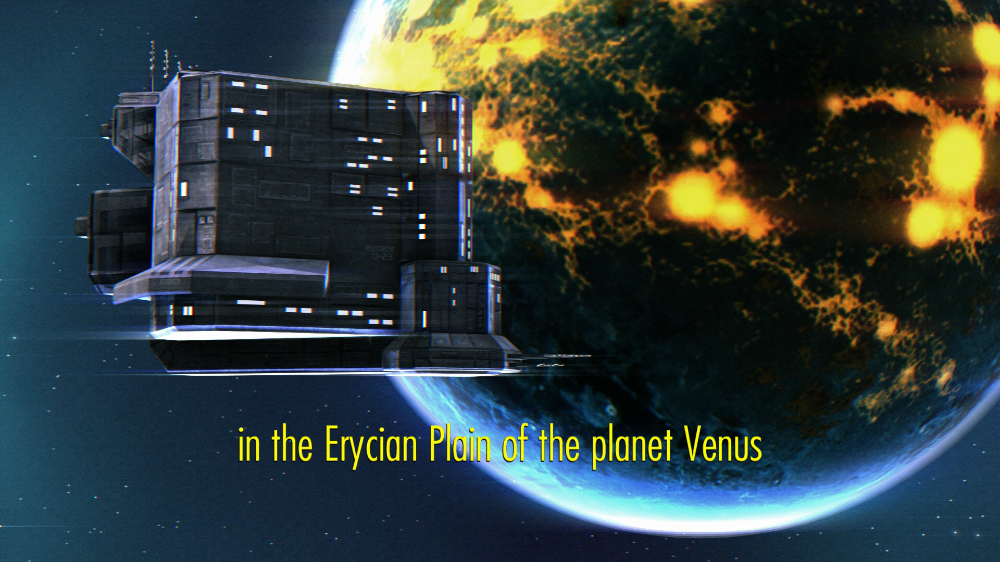

*The Venus reference and massive modular vessel reconnect the Eryx lineage to industrial scale and travel. The current work brings that planetary threshold down to the player's local, traversable scale.*

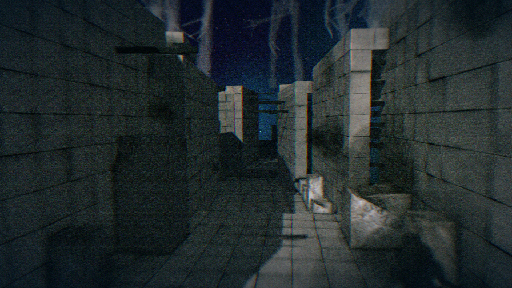

*A forward-moving viewpoint turns repeated wall modules into a navigated spatial sequence. The new project retains the sense of passage but relocates the crucial alien boundaries into invisible traversal semantics rather than copying this visible maze.*

Other retained references locate this direct Eryx line within the author's broader visual education:

- *Enigma* by Phenomena: raytraced imagery as a technical and emotional event
- *Origin Complex*: linked modules, cockpit perception, and navigated computed architecture
- *Substance*: minimal corridor space near the threshold of playability
- *Hardwired*: geometry, material performance, and computational vertigo
- *Amiga Desert Dreams*: sparse line-based routes that become mental architecture

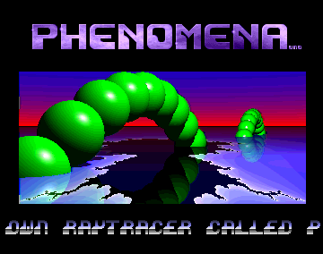

*Few elements can carry strong technical wonder when their computation is perceptible.*

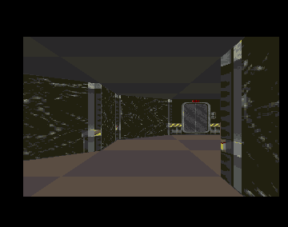

*Repeated modules, sharp depth, and an uncertain beyond make architecture a transit system rather than a complete place.*

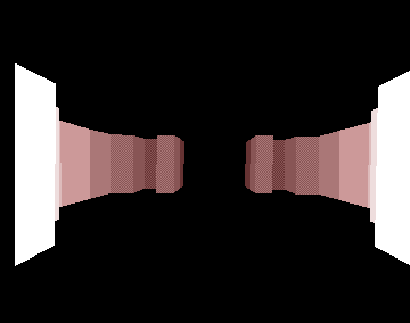

*Almost nothing is shown, yet direction and spatial pressure already exist.*

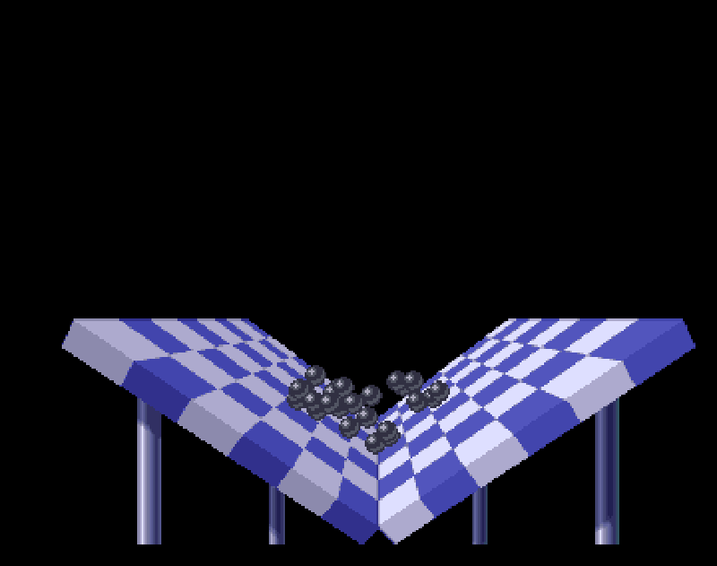

*The object, environment, and demonstration of computation become inseparable.*

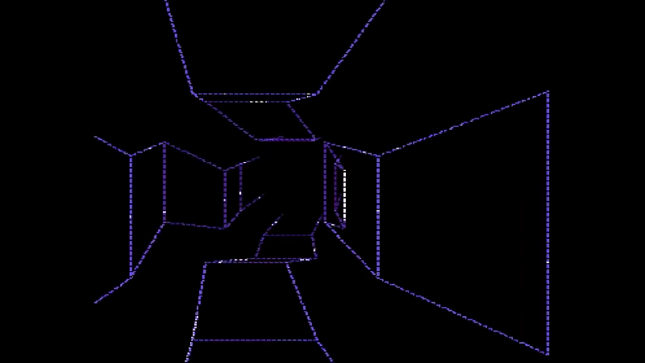

*A luminous trace is enough to create a route, threshold, and implied world.*

### 3. Present generative transformation

The current work turns unstable computed space into something the player can inhabit. The lineage is no longer only visual:

```text
suggested space
    -> performed computed space
    -> navigated demoscene space
    -> generatively reconfigured interactive space
```

The player issues commands, surveys local geometry, tests traversal, marks routes, and retraces them. A local model can propose controlled changes to selected topological relations. The renderer supplies only a partial instrumental image, while text and collision semantics may know about a wall the image cannot show.

The present image should therefore not imitate an earlier production. It should inherit a logic:

- a small amount of visible information carries high semantic pressure
- omission makes the player model the space mentally
- changing computation is part of the event
- the machine's limits remain present in the result

## Spatial visualization

### Space is a hypothesis, not a full simulation

Across *Driller*, *The Sentinel*, *Tau Ceti*, *Midwinter*, *Origin Complex*, *Substance*, and *Amiga Desert Dreams*, space is established by a few authoritative decisions:

- a cut in the ground
- a slope or ramp
- a slab or retaining wall
- an opening
- a beacon against an empty field
- a strong axis of retreat or advance
- an uncertain horizon

The player reads a directional structure rather than an exhaustive environment. This is ideal for Eryx: local geometry can be convincing without proving that the global map is stable.

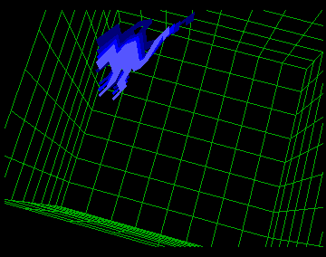

*Depth is suggested with authority rather than filled with detail.*

### Quarry brutalism is structural

The active setting gives concrete meaning to severe primitive geometry. Boxes and planes should become:

- quarry faces and excavation cuts
- slabs, ramps, trenches, and retaining structures
- prospecting shelters and pressure thresholds
- instrument housings, cargo, and extraction modules
- sparse pylons, beacons, and scanner stations

The intended composition favors flat masses, hard diagonals, rectangular voids, repetition, and a clear distribution of occupied versus empty space. “Brutalist” means that the world feels built, excavated, and surveyed. It is not a generic surface treatment.

### The invisible labyrinth must stay invisible

The maze should not be visualized as a complete corridor plan. Its presence comes from mismatches among channels:

- movement fails across apparently open terrain
- text identifies a surface the viewport cannot resolve
- a scanner or diagnostic contour suggests a plane temporarily
- dust, vapor, shadow, or an object produces indirect contact evidence
- a known view remains recognizable while its exits or connections change

Ordinary play should retain uncertainty. A fully visible topology may exist only as an optional diagnostic view for development and research.

### The off-screen world matters as much as the visible one

Large dark, empty, or underdescribed regions are productive. They imply that the fiction extends beyond rendering range and that perception is mediated.

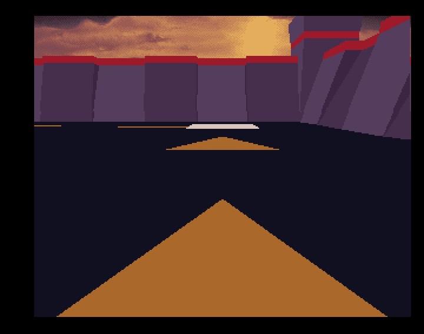

*Large fields and few objects can remain spatially charged.*

For the project, off-screen and unrendered space can contain uncertain routes, inferred barriers, or incompatible map claims. The image should orient the current action without guaranteeing the surrounding world.

### Lighting is an instrument

Lighting should reveal rather than beautify. Its functions are to:

- isolate a landmark or extraction module
- distinguish foreground, surface, and void
- suggest incomplete sensing range
- make noise and uncertainty materially visible
- expose indirect evidence of an unseen boundary when required

The camera-linked light is therefore closer to a survey lamp or sensor than a cinematic key light.

### Visual poverty intensifies strangeness

A sparse image can be more unsettling than a rich one when simplification is coherent. The useful tension comes from:

- strong fiction carried by little visible data
- recognizable infrastructure that remains incomplete
- the mismatch between possible movement and apparent openness
- the gap between locally stable landmarks and globally unstable connections

This is a low-information but high-tension image, not a nostalgic imitation of low resolution.

### The world is traversed and tested

The corpus favors actions such as:

- advance
- inspect
- cross
- circle
- mark
- retrace
- compare
- verify

The Eryx version adds surveying and mapping. Space need not be comfortable or richly inhabited; it must provide decisions and evidence.

## Interface as perceptual apparatus

### The interface is not neutral framing

In *Tau Ceti*, *Borrowed Time*, *Whale's Voyage*, *Uninvited*, *Les Portes du Temps*, *Oxphar*, and *Captain Blood*, the interface tells the player that access to the world is mediated by a machine.

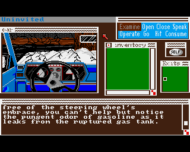

*Compartmentalization exposes the system's different forms of knowledge.*

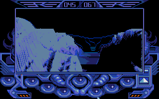

*The viewing apparatus contributes as much presence as the represented space.*

The project's interface should similarly distinguish:

- rendered local perception
- narrative interpretation
- player command
- current instrument or survey feedback
- optional debug and computation status

The player should not confuse a narrative statement, a machine measurement, and a debug fact.

### Text and image divide the work of world-making

Text can name, qualify, remember, or contradict. The image can situate, orient, and establish material mood. Neither should exhaust the world.

For Eryx, this division is structural:

> The text may know that there is a wall where the image shows nothing.

The image should therefore not be evaluated only by how completely it illustrates prose. Its value lies in maintaining a partial, actionable, and sometimes incompatible perceptual channel.

### Compartmentalization supports research readability

A compact panel layout can expose the transformation chain without becoming a generic developer dashboard. Useful regions include:

- viewport
- short transcript
- command input
- survey or mapping status
- busy/cancellation state
- optional timing and validator diagnostics

Typography, borders, icons, and spacing are structural. They can carry world identity and reduce the amount of geometry the viewport must provide.

### The interface can acknowledge latency

The reference corpus tolerates waiting, staged refresh, and discontinuous updates. The local model's latency can be presented through:

- retention of the last valid view
- a restrained computation indicator
- sequential arrival of interpretation, validation, and rendered evidence where useful
- visible timings in research or exhibition mode

Latency should acquire rhythm without becoming a false spectacle of technical activity.

## Translation into the current project

### Already present in the renderer and runtime

- simple geometric masses
- hard camera-linked light
- visible raytracing noise
- a sparse scene language and deterministic compiler path
- a parser-like SDL3 interface
- separation between authoritative state and generated text
- local room generation, caching, and weak global topology

These are implemented technical foundations, even though the current build still uses datacenter/desert semantics.

### Planned Eryx adaptations

- quarry, plateau, shelter, extraction-field, and scanner-station archetypes
- high-value prospecting prefabs and semantic reinterpretation of existing geometry
- persistent local visual anchors for revisited places
- invisible barrier semantics separated from ordinary blocked exits
- indirect evidence that can reveal an unseen plane without making it a normal wall
- clearer differentiation between text, sensor result, traversal result, and debug fact
- an authored ghost-player sequence based on survey, retracing, contradiction, and remapping

These are intentions, not current runtime features. [`TECHNICAL_STATE.md`](./TECHNICAL_STATE.md) records the implementation boundary.

### Avoid

- generic cyberpunk or datacenter-horror iconography
- NASA-style realism used as a substitute for a coherent mediated Venus
- decorative “Lovecraftian” symbols or cosmic-horror clichés
- a visible corridor maze that eliminates perceptual uncertainty
- arbitrary geometric micro-detail with no action or compositional value
- UI chrome that merely quotes the 1980s
- arbitrary color expansion controlled by the LLM
- topology changes that lack actionable feedback

## Direction statement

The most accurate mood description is:

> A low-information but high-tension Venusian survey image: human extraction geometry is locally readable, alien topology remains invisible, and a machine-mediated interface lets text, movement, and rendering disagree without abandoning play.

The visual language is a situated computational aesthetic and a contemporary translation of constraint-based expressivity. It asks the player to navigate an image that is partial by design, not obsolete by imitation.

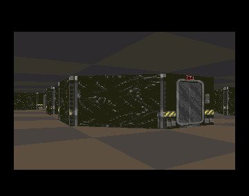

*Sparse surfaces, doors, and a strong viewing apparatus remain close to the desired current grammar.*

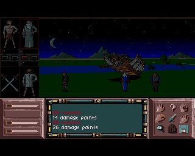

*A few silhouettes and a dark field can make an exterior feel much larger than its geometry.*

## Conclusion

The moodboard describes a progression from suggested space, through performed demoscene space, to a navigable and generatively reconfigured labyrinth. The project should retain sparse geometry, strong framing, shared text/image authorship, and visible computation while giving them a new fictional necessity: the player can see human extraction infrastructure but cannot directly see the architecture that controls movement.

The result is not retro. It is an inherited visual grammar of incomplete space made active under a contemporary allocation of computation.
