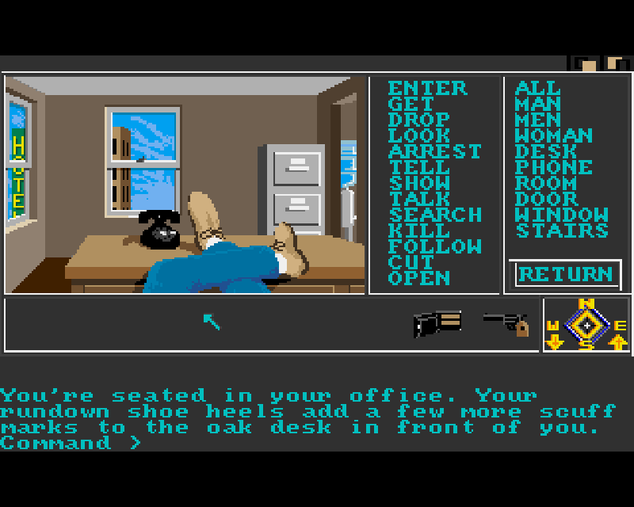
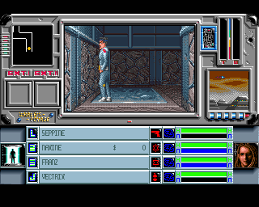
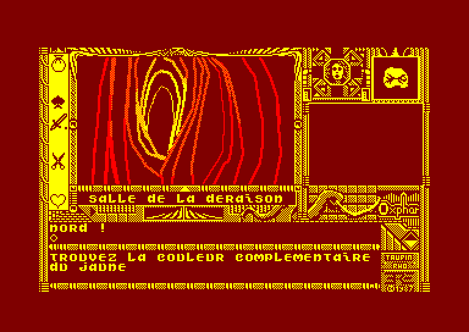
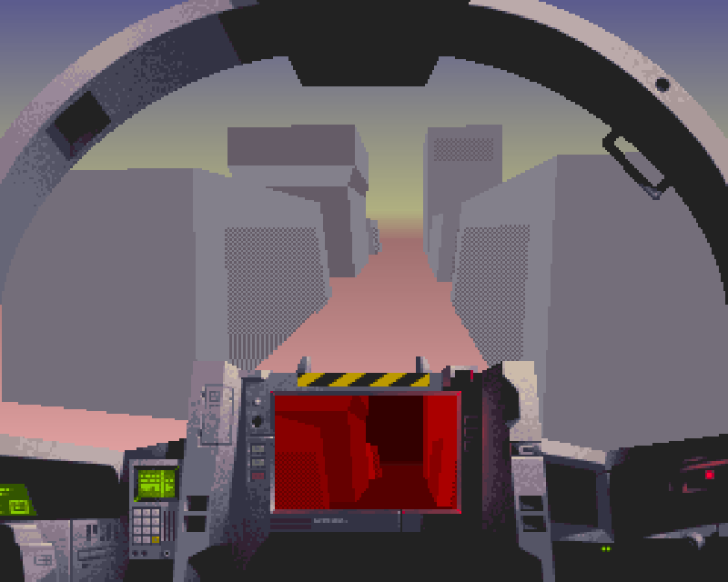
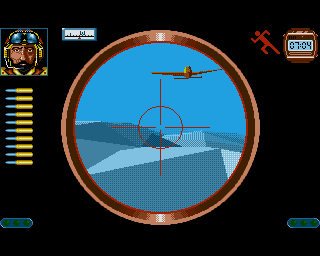
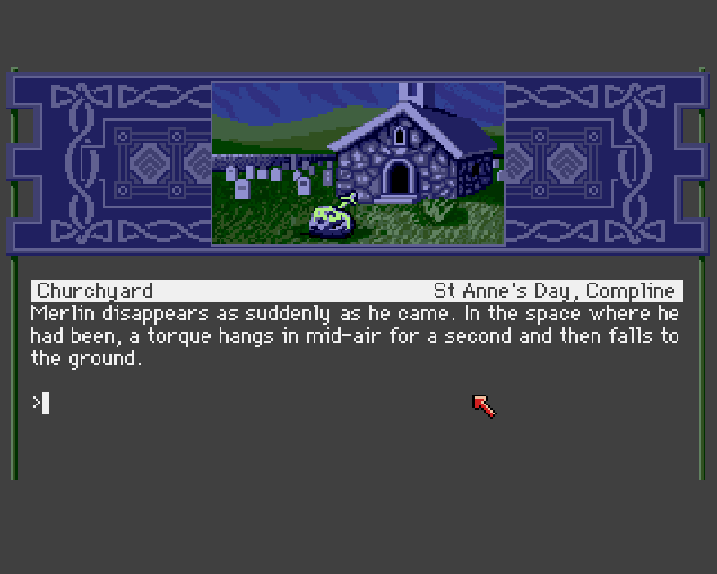
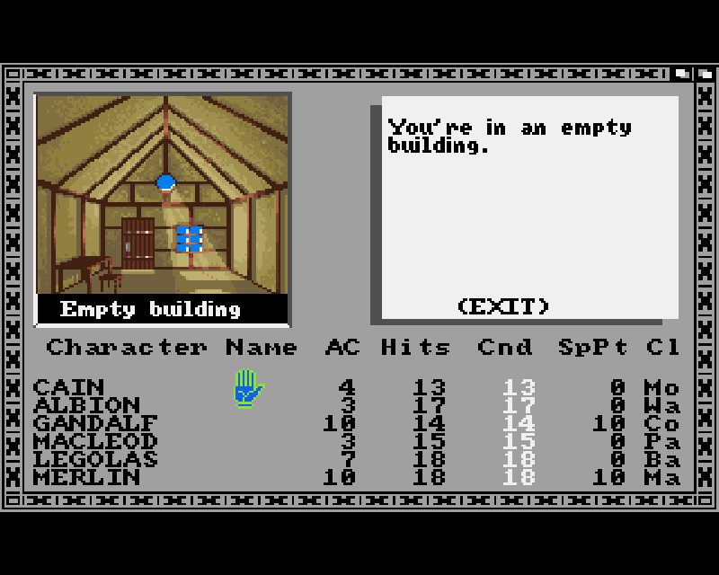
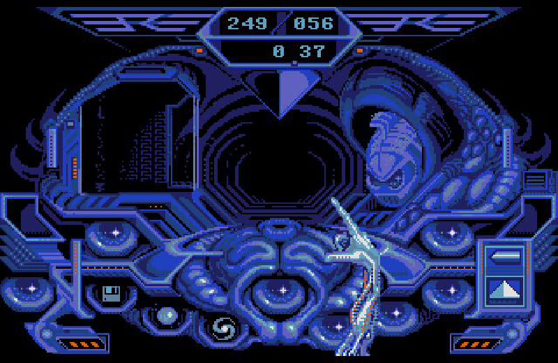

# Ambiance low-fi expressive par contrainte

## Objet

Ce document synthétise ce que le moodboard de `documentation/moodboard` produit comme ambiance lorsqu'on le relit à travers la note d'intention de [`SPEC.md`](./SPEC.md) et le rendu actuel de [`img/liminal-room.png`](../img/liminal-room.png).

L'enjeu n'est pas de copier une esthétique rétro comme un vernis. Le point commun du corpus est plus précis : une image pauvre, parfois brutale, mais très lisible dans ses intentions, où la contrainte technique devient une manière de penser l'espace, l'action et l'interface.

Il faut y ajouter un point décisif : ce corpus ne renvoie pas seulement à une histoire générale du jeu vidéo. Il renvoie à une histoire située, vécue, formative. Le projet cherche donc à construire un **pont sensible, nostalgique et fondateur** entre des images 16 bits reçues à l'adolescence et une proposition contemporaine qui reprend leur puissance de suggestion sans se contenter de les citer.

## Thèse générale

Ces univers low-fi produisent une ambiance de **monde incomplet mais opératoire**.

Ils ne donnent jamais l'illusion d'un espace totalement simulé. Ils donnent plutôt des indices suffisants pour que le joueur reconstruise mentalement un lieu, une distance, un danger, une direction, une humeur. Leur puissance ne vient pas d'une richesse descriptive continue, mais d'une économie de signes :

- quelques volumes simples
- une profondeur marquée
- un contraste fort entre zones lisibles et zones aveugles
- une interface très présente
- un texte qui complète ce que l'image ne montre pas

Le rendu actuel du projet va déjà dans cette direction : pièce nue, primitives sévères, lumière frontale, bruit visible, profondeur inquiétante, lisibilité minimale mais réelle. Le moodboard suggère comment densifier cette base sans la trahir.

## Pont sensible et fondateur

Le lien avec les références 16 bits ne doit pas être compris comme un simple geste rétro. Il s'agit plutôt de réactiver un régime de perception appris très tôt :

- apprendre à lire un monde avec peu d'information
- projeter du mystère dans des volumes sommaires
- accepter qu'une interface fasse partie du décor mental
- sentir qu'une machine montre moins qu'elle ne promet
- associer la pauvreté de calcul à une intensité d'imaginaire

La nostalgie utile ici n'est donc pas une nostalgie de collectionneur. C'est une nostalgie de relation :

- relation à l'écran
- relation à l'attente
- relation au texte
- relation au hors-champ
- relation à une image encore assez pauvre pour demander un travail actif au regardeur

La proposition contemporaine peut alors se comprendre comme une continuation plutôt qu'une citation. Le projet ne revient pas au 16 bits ; il reprend ce que ces images ont fondé dans le regard, puis le déplace vers un autre partage du calcul, où la dépense technique quitte le rendu pour migrer vers l'inférence, la fiction et l'instabilité du monde.

## Jeux et démos : une même scène d'apparition

Ce qui frappe dans ce corpus, c'est la communication constante entre les jeux et les démos de la même époque. Cette communication n'est pas un simple air de famille. Elle tient à un socle commun :

- la même machine ou le même horizon de machine
- le même moment d'invention visuelle
- la même économie de calcul
- la même volonté de faire apparaître des images encore neuves

Les jeux retenus ici ont, de ce point de vue, un statut très particulier : ils appartiennent au moment des premiers jeux sortis sur Amiga. Ils ne sont donc pas seulement des références efficaces ; ils sont déjà des gestes inauguraux. Ils posent très tôt des questions qui restent actives dans ce projet :

- comment faire exister un espace avec peu
- comment donner à l'image une force de monde sans réalisme plein
- comment articuler texte, interface et profondeur
- comment faire sentir la machine à travers ce qu'elle montre

Les démos sont pionnières elles aussi, mais d'une autre manière. Elles radicalisent l'apparition. Elles montrent moins un monde utilisable qu'une possibilité visuelle en train de naître. Elles poussent plus loin :

- l'image comme événement
- la plasticité du calcul
- l'ivresse des premières formes
- la démonstration sensible d'une puissance encore instable

D'où cette porosité très forte : les jeux semblent parfois être des démos contraintes par l'action, tandis que les démos ressemblent parfois à des jeux libérés de l'obligation de jouabilité. Les uns et les autres parlent, à des intensités différentes, la même langue historique : celle des premières images Amiga assez fortes pour fonder durablement un regard.

Un motif rend cette communication particulièrement visible : le `cockpit`. On le voit dans les jeux, bien sûr, avec `Tau Ceti` ou `Midwinter`, mais aussi dans les démos comme `Origin Complex`. L'image n'y est pas donnée frontalement comme une fenêtre neutre sur le monde ; elle est enchâssée dans un appareil, un poste, un viseur, une cabine, une console. Cela permet à la fois de dramatiser la perception et de réduire ce qu'il faut effectivement représenter. Une part de l'intensité visuelle vient alors du cadre-machine autant que du monde vu à travers lui.

## Visuels clés

### 1. Point d'ancrage contemporain

_Le rendu actuel pose déjà une base juste : espace nu, brutalité géométrique, lumière portée, bruit conservé, profondeur inquiétante._

### 2. Espaces low-fi, directionnels, incomplets

_`Driller` montre comment quelques volumes simples et des diagonales dures suffisent à produire une sensation d'hostilité, de passage et de désorientation._

_`The Sentinel` pousse encore plus loin cette logique : l'espace est presque vide, mais il reste tendu, lisible, et mentalement très actif._

_Dans `Origin Complex`, l'architecture devient un dispositif de transit : profondeur coupée, modules répétés, promesse d'un au-delà non garanti._

_`Enigma` rappelle un moment fondateur : l'image calculée comme événement en soi, avec peu d'éléments mais une forte charge d'émerveillement technique._

_`Substance` pousse l'abstraction jusqu'au seuil de l'image jouable : presque rien, mais déjà une profondeur, un passage, une mise en tension du regard._

_`Hardwired` montre une autre branche pionnière : l'espace comme performance géométrique et matérielle, à mi-chemin entre objet, décor et démonstration._

### 3. Texte et image à parts égales

_`The Pawn` est crucial ici : le texte y occupe autant de place que l'image, sans que l'un dégrade l'autre. L'écran affirme à la fois une ambition littéraire et une picturalité forte, déjà pionnière sur Amiga._

### 4. Interfaces comme appareils de lecture

_`Tau Ceti` montre une image enchâssée dans un appareil. Le monde n'apparaît pas nu : il est lu à travers un tableau de bord._

_`Borrowed Time` est important pour la relation texte-image-action : l'interface ne masque pas son système, elle l'expose clairement._

_`Whale's Voyage` donne une référence utile pour une UI compacte, appareillée, où la scène et les données de contexte cohabitent sans se dissoudre._

_02.png>)

_`Les Portes du Temps` insiste sur la logique de fenêtres, de cadres et de zones fonctionnelles ; une piste pertinente pour une interface de surveillance fictionnelle._

## Visualisation spatiale

### 1. L'espace est une hypothèse, pas une simulation

Dans `Driller`, `The Sentinel`, `Tau Ceti`, `Midwinter`, `Origin Complex` ou certaines images démoscene comme `Substance` et `Amiga Desert Dreams`, l'espace n'est pas détaillé de manière uniforme. Il est posé par grandes décisions géométriques :

- un couloir
- une pente
- une salle
- un vide
- un seuil
- une ligne d'horizon

Le joueur ne lit pas un monde complet. Il lit une structure directionnelle. Cela produit une ambiance très particulière : on se sent situé, mais jamais totalement installé.

_Dans `Voyage`, quelques lignes suffisent à faire apparaître un volume habitable. La profondeur n'est pas remplie ; elle est suggérée avec autorité._

### 2. La spatialité est faite de plans francs et de coupes nettes

Le corpus insiste sur :

- des murs plats
- des aplats noirs ou monochromes
- des volumes abrupts
- des diagonales simples
- des ouvertures rectangulaires
- des sols qui servent de vecteur de fuite

Cette brutalité de construction donne aux lieux une qualité mentale ou maquette. Ce ne sont pas des environnements naturalistes ; ce sont des configurations. Même lorsqu'un décor est censé être organique ou extérieur, il reste souvent traité comme un assemblage de masses lisibles.

Pour le projet, cela confirme une piste importante : la force de l'image ne dépend pas d'une complexité géométrique élevée, mais d'une **bonne répartition des masses, des vides et des seuils**.

La présence des démos renforce encore ce point. Elles montrent que cette lecture par masses et par coupes n'est pas seulement un expédient du jeu commercial ; c'est un langage visuel commun à tout un moment pionnier de la machine.

_Cette image de `Amiga Desert Dreams` est exemplaire : presque rien d'autre qu'un tracé lumineux, mais déjà une architecture mentale, un parcours, une sensation de seuil._

### 3. Le hors-champ compte autant que le visible

Beaucoup d'images du moodboard laissent de larges zones opaques, noires, indéterminées ou peu informées. Ce manque n'est pas seulement une limitation : c'est un moteur d'ambiance.

L'espace low-fi fonctionne souvent par :

- occultation
- découpe
- cadrage étroit
- profondeur incertaine
- détails repoussés hors de l'image ou dans le texte

L'effet produit est liminal : le lieu semble continuer au-delà de ce qui est rendu, mais sans garantie de cohérence complète. Cela rejoint directement la spec du projet : cohérence locale, dérive globale.

_`Real Complex` montre bien comment de grands aplats, peu d'objets et une perspective sévère peuvent suffire à produire une ambiance de lieu incomplet mais pleinement actif._

### 4. La lumière sert à révéler, pas à embellir

Dans le moodboard, la lumière est rarement naturaliste. Elle sert surtout à :

- désigner une forme
- séparer avant-plan et fond
- signaler un danger ou une présence
- donner une température artificielle au lieu

Le projet traduit déjà cela en noir et blanc avec une lumière portée et un bruit de raytracé conservé. C'est un bon équivalent contemporain de cette logique. Le point important est de garder une lumière **instrumentale**, presque technique, comme si l'image était produite par une machine de reconnaissance plus que par une caméra cinématographique.

### 5. La pauvreté visuelle renforce l'étrangeté

Ce corpus montre qu'une image sommaire peut devenir plus troublante qu'une image riche, à condition que la simplification soit assumée.

L'étrangeté vient ici de plusieurs facteurs :

- disproportion entre peu d'information visuelle et forte charge fictionnelle
- objets ou architectures reconnaissables mais incomplets
- personnages rares, souvent isolés
- discontinuité entre ce que l'image promet et ce qu'elle livre vraiment

Le low-fi ne produit donc pas seulement de la nostalgie. Il produit de l'incertitude exploitable.

### 6. Le monde est plus souvent traversable qu'habitable

Le moodboard donne rarement envie de "vivre" dans les lieux. Il donne envie de :

- avancer
- inspecter
- franchir
- contourner
- revenir
- vérifier

Les espaces sont des lieux de passage, d'observation et d'interprétation. Cette qualité est essentielle pour un jeu à commandes textuelles : l'image n'a pas besoin d'offrir une richesse résidentielle ; elle doit offrir une tension de navigation.

## Interface utilisateur

### 1. L'interface n'est pas un habillage, c'est une prothèse cognitive

Dans `Tau Ceti`, `Borrowed Time`, `Whale's Voyage`, `Uninvited`, `Les Portes du Temps`, `Oxphar` ou `Captain Blood`, l'interface ne cherche pas la discrétion. Elle dit au joueur :

- tu consultes un dispositif
- tu lis à travers une machine
- tu agis par médiation

L'image du monde est presque toujours enchâssée dans un cadre plus grand qui contient des commandes, du texte, des jauges, des listes, des icônes, des repères. Cette surprésence de l'interface crée une ambiance de terminal, de cockpit, de tableau de bord ou de poste de surveillance.

Pour le projet, c'est très cohérent avec la spec : l'interface devrait sembler moins proche d'un HUD moderne que d'un appareil d'investigation.

_`Uninvited` montre une interface qui pense à voix haute : la scène, les verbes, l'inventaire et le texte ne sont pas séparés par pudeur moderne, mais par nécessité cognitive._

_`Oxphar` pousse la logique plus loin encore : l'interface devient quasiment le monde lui-même, avec une densité graphique qui tient autant du tableau de contrôle que de la page enluminée._

_Dans `Captain Blood`, le cadre d'affichage n'est pas neutre. Il donne à la consultation du monde une texture presque organique, comme si la machine regardait avec le joueur._

### 2. Le cockpit comme appareil de perception

Entre jeux et démos, le `cockpit` est plus qu'un décor d'interface. C'est une technique de mise en scène et une économie de production. En enchâssant l'image dans un dispositif, l'écran affirme plusieurs choses à la fois :

- le joueur ne voit jamais directement, il voit par machine interposée
- le cadre ajoute de la densité visuelle sans exiger un monde complet derrière
- la perception devient dramatique, ciblée, instrumentale
- la machine fait partie du monde sensible, pas seulement de son contrôle

Autrement dit, le `cockpit` produit de la présence avec peu. Il transforme une restriction de représentation en avantage d'ambiance.

_Dans `Origin Complex`, le paysage est moins important que l'appareil depuis lequel il apparaît. La cabine, les consoles et le moniteur fabriquent à eux seuls une grande part de l'intensité visuelle._

_`Midwinter` montre une version très efficace de ce principe : un simple viseur circulaire suffit à transformer un paysage sommaire en situation tendue, lointaine, presque militaire._

### 3. Le texte et l'image se partagent le travail du monde

Le moodboard montre une constante fondamentale : l'image seule ne suffit pas, et ce n'est pas un problème.

Le texte sert à :

- nommer
- préciser
- compléter le hors-champ
- interpréter l'action
- donner une densité fictionnelle que l'image ne peut pas porter seule

L'image, elle, sert à :

- situer
- orienter
- produire une humeur
- confirmer ou contredire partiellement le texte

Cette tension texte-image est au cœur du projet. L'image ne doit pas devenir une illustration exhaustive de la narration. Elle doit rester une traduction partielle, parfois réductrice, parfois oblique.

`The Pawn` est ici une référence essentielle, parce qu'il légitime une ambition double. Le texte n'y compense pas une faiblesse de l'image, et l'image n'y sert pas de simple récompense décorative au texte. Les deux construisent ensemble une même promesse de monde. Pour `Liminal Raytraced LLM World`, c'est un précédent important : il n'y a pas à choisir entre héritage parser et force picturale, à condition d'assumer leur tension.

### 4. Les interfaces low-fi sont compartimentées

Le corpus emploie beaucoup de dispositifs à fenêtres ou à panneaux :

- un viewport principal
- une zone de verbes ou d'actions
- une zone textuelle
- des jauges
- un inventaire
- des portraits ou états

Cette compartimentation a deux effets. D'une part, elle augmente la lisibilité. D'autre part, elle rappelle constamment que le joueur manipule un système incomplet, discrétisé, fait de modules. C'est une bonne référence pour le projet : séparer clairement transcription, image, saisie, et données de debug renforcera l'identité "outil" plutôt que "vitrine".

### 5. L'ornement GUI comme économie de représentation

Dans `Arthur - The Quest for Excalibur` ou `The Bard's Tale`, il faut ajouter un autre point important : l'ornement n'est pas superficiel. Les cadres, motifs, frises, panneaux et bordures servent aussi à déplacer l'effort de création. Une partie de la richesse perçue de l'écran vient de ce système ornemental plutôt que d'une inflation du monde représenté.

Cela produit une économie très efficace :

- l'ornement remplit l'écran sans exiger un décor entièrement détaillé
- le cadre donne une identité forte à des images de petite taille
- la GUI transforme quelques fragments figuratifs en scène complète
- le système visuel paraît riche alors même que la représentation du monde reste très contrainte

Ce point est essentiel pour le projet, parce qu'il ouvre une piste concrète : la puissance d'une interface ne vient pas seulement de sa neutralité fonctionnelle. Elle peut aussi venir de sa capacité à porter une part du monde, à absorber une part de la charge imaginaire, et donc à soulager le rendu lui-même.

_Dans `Arthur`, l'image est petite, mais elle ne paraît pas pauvre, parce qu'elle est soutenue par tout un système de frises, de panneaux et de texte qui la met en valeur et complète sa charge fictionnelle._

_`The Bard's Tale` montre une autre variante de cette économie : un petit viewport, beaucoup de structure GUI, et pourtant une sensation d'univers déjà constitué._

### 6. La typographie et l'iconographie sont structurelles

Dans ces univers, la police, les cadres, les filets, les icônes et les couleurs de statut ne servent pas seulement à décorer. Ils forment la texture même de l'expérience.

L'interface low-fi fonctionne souvent avec :

- des polices pixel nettes
- des icônes simples et répétables
- des cadres épais
- une grille explicite
- des contrastes francs
- une faible ambiguïté fonctionnelle

Pour le projet, cela suggère une UI sobre mais très dessinée : peu d'éléments, bien délimités, avec une logique presque éditoriale ou technique.

Il ne s'agit donc pas seulement de "faire rétro" avec des cadres. Il s'agit de comprendre que, dans ces objets pionniers, le cadre, le cockpit et l'ornement prennent en charge une partie du travail de monde. Ils ne viennent pas après la représentation ; ils la rendent possible à moindre coût.

### 7. L'interface peut assumer la latence

Le corpus n'est pas construit autour de la fluidité continue. Il supporte très bien :

- l'attente
- le rafraîchissement par étapes
- la mise à jour de zones distinctes
- la sensation qu'un calcul est en cours

Dans le projet, la latence du LLM n'a donc pas besoin d'être masquée absolument. Elle peut être mise en scène par :

- un viewport qui reste présent comme trace du dernier état
- des timings visibles
- un panneau d'état discret
- une apparition séquentielle du texte, de la scène et du rendu

## Traduction vers le projet

### Ce que le rendu actuel capture déjà

- la frontalité austère
- la lecture par volumes simples
- la solitude du lieu
- la lumière dure
- le bruit comme matière visuelle
- le sentiment de pièce partielle plutôt que de décor fini

### Ce qu'il faudrait accentuer

- des seuils plus affirmés : portes, couloirs, ouvertures, puits, escaliers, sas
- des différences d'échelle plus lisibles entre vide principal et détails secondaires
- une composition qui utilise davantage les zones aveugles
- une UI plus structurée, plus appareillée, moins neutre
- une relation plus explicite entre texte, image, et état-machine

### Ce qu'il faudrait éviter

- un rendu trop propre ou trop homogène
- une interface invisible ou purement "app"
- une image qui explique tout
- une abondance de micro-détails géométriques sans effet sur l'action
- une esthétique rétro citée comme motif graphique sans fonction systémique

## Direction d'ambiance

La meilleure synthèse du moodboard pour ce projet n'est ni "rétro", ni "minimaliste", ni "brutaliste" pris isolément. C'est plutôt :

> une machine fictionnelle pauvre en image, mais précise en tension spatiale ; héritière à la fois des premiers jeux Amiga et des démos pionnières ; une interface-outil qui expose ses limites ; un monde visible par fragments, plus inquiétant parce qu'il reste partiellement non calculé

Autrement dit, l'ambiance vise moins la reconstitution historique que la **traduction contemporaine d'une expressivité sous contrainte** :

- espace discontinu mais lisible
- image lacunaire mais évocatrice
- interface présente mais utile
- fiction plus vaste que ce qui est montré
- technique visible comme condition esthétique

_Cette image de `Captain Blood` réunit très bien deux motifs centraux du corpus : le cockpit et l'ornement. La richesse sensible de l'écran vient autant de l'appareil qui encadre la vision que de ce qui est effectivement représenté dans le viewport._

_`Origin Complex` est ici plus proche de la référence visuelle du projet : peu de géométrie, surfaces austères, portes, couloirs, brutalité calme, et impression d'espace calculé à l'essentiel._

_`Drakkhen` rappelle qu'un monde très pauvre en modélisation peut malgré tout produire une scène mémorable : quelques silhouettes, une nuit profonde, un objet étrange, et tout l'espace devient fictionnellement chargé._

## Conclusion

Le moodboard confirme que la force de ces univers low-fi ne vient pas d'une "pauvreté" prise comme manque, mais d'une répartition très nette des fonctions entre géométrie, cadrage, texte et interface. Pour `Liminal Raytraced LLM World`, cela ouvre une direction claire : conserver la sévérité monochrome du rendu actuel, mais lui donner un cadre d'usage plus fortement instrumental, plus compartimenté, et plus habité par l'idée qu'on explore un monde calculé à moitié, observé à travers une machine.

Ce cadre a aussi une fonction plus intime : faire remonter, sans pastiche, ce que les images 16 bits ont installé une première fois dans le regard adolescent. Le projet devient alors moins une imitation du passé qu'une réactivation contemporaine de son pouvoir de fondation.

La porosité entre jeux fondateurs et démos pionnières permet d'ailleurs de formuler plus justement cette filiation. Ce qui revient ici, ce n'est pas un style rétro fermé sur lui-même. C'est un moment historique où jouer, regarder, attendre et croire à l'apparition d'une image relevaient encore d'une même expérience. C'est ce noyau sensible que le projet peut reprendre aujourd'hui.
