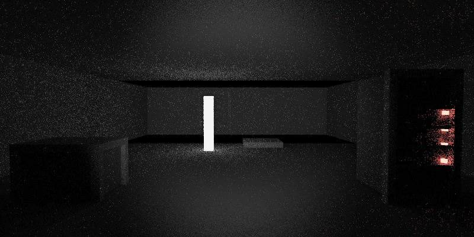
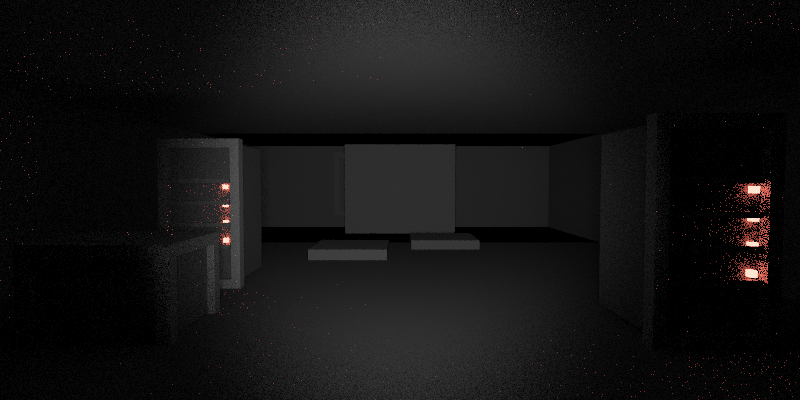
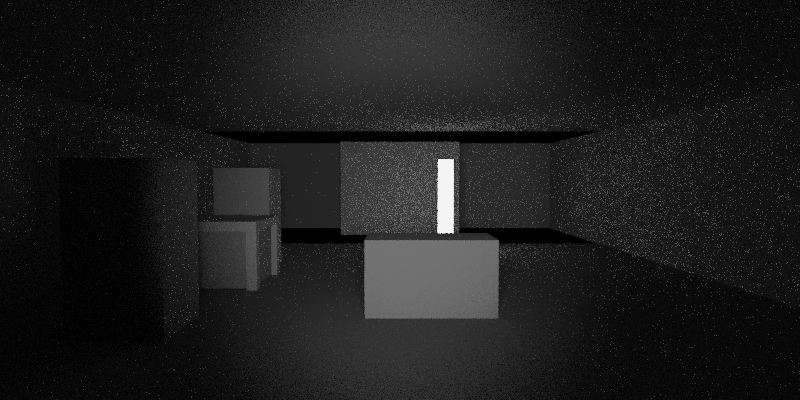
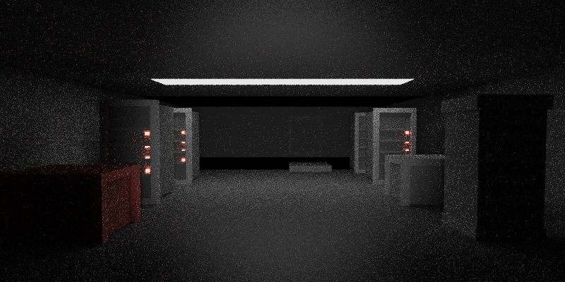
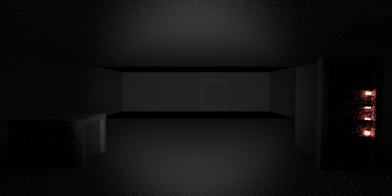
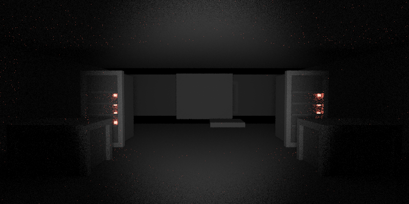
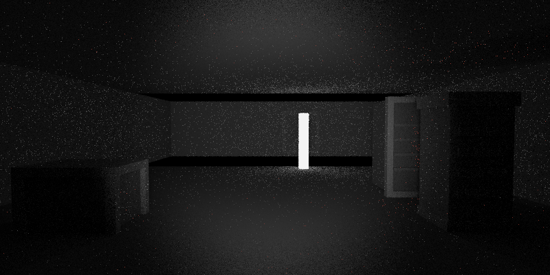
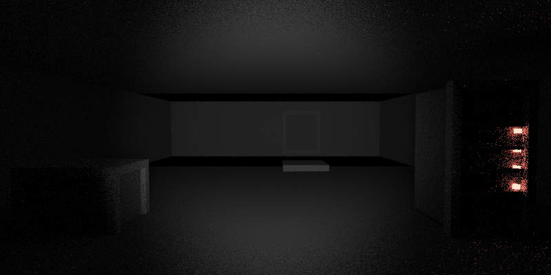
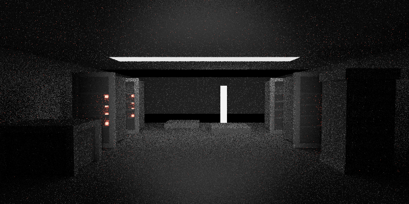
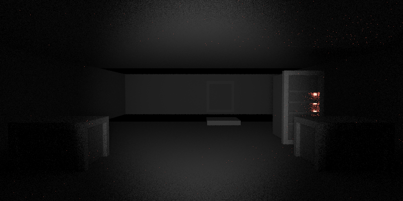

# Hybrid Scene Generation Benchmark

Genere le 2026-08-02 16:19:10.

Ce document audite la nouvelle chaine runtime :
- room brief source
- commande cardinale
- metadata JSON produite par le LLM local
- compilation hybride deterministe `SpatialState -> .scene`
- audit du `.scene` compile et rendu PNG

Comparaison :
- le benchmark historique `SCENE_GENERATION_BENCHMARK.md` mesure la voie directe `brief -> .scene brut par Ministral`
- ce benchmark mesure la voie runtime `brief source -> room JSON -> compilateur hybride -> rendu`

Parametres :
- rendu : `800x400`, `8` spp, `3` bounces, `1` direct samples
- runtime LLM : `temperature=0.0`, `n_predict=1024`, `json_grammar=off`

Resultat global : `10/10` rendus valides, dont `0` avec fallback.

| Case | Dir | Status | Metadata | Scene | Infer ms | Prep ms | Render ms | Triangles |
| --- | --- | --- | --- | --- | ---: | ---: | ---: | ---: |
| `entry_gate_dusk` | `NORTH` | `valid` | `llm` | `hybrid` | 7787.57 | 10898.24 | 803.02 | 460 |
| `sally_port_checkpoint` | `NORTH` | `valid` | `llm` | `hybrid` | 9338.74 | 12441.81 | 645.94 | 628 |
| `badge_vestibule` | `NORTH` | `valid` | `llm` | `hybrid` | 7549.01 | 10661.65 | 607.01 | 340 |
| `server_aisles_dense` | `NORTH` | `valid` | `llm` | `hybrid` | 9187.81 | 12328.85 | 1330.60 | 1062 |
| `control_hub` | `NORTH` | `valid` | `llm` | `hybrid` | 7077.20 | 10168.62 | 560.99 | 424 |
| `backup_vault` | `EAST` | `valid` | `llm` | `hybrid` | 8082.58 | 11261.46 | 668.25 | 676 |
| `cooling_exchange_bay` | `NORTH` | `valid` | `llm` | `hybrid` | 8102.99 | 11222.40 | 890.40 | 520 |
| `loading_dock_dust` | `EAST` | `valid` | `llm` | `hybrid` | 9683.33 | 12801.16 | 607.95 | 436 |
| `roof_watch_dusk` | `NORTH` | `valid` | `llm` | `hybrid` | 7900.49 | 11002.84 | 1176.02 | 894 |
| `stairhead_parapet` | `NORTH` | `valid` | `llm` | `hybrid` | 8223.88 | 11470.38 | 701.68 | 508 |

## Entry Gate

A concrete gate court faces the datacenter threshold. Dust clings to the bars and the badge reader blinks beside a service intercom.

Direction benchmarkee : `north`
Status : `valid`
Updated place : `Access Tunnel`
Intent : `move_north_generated_room`
Metadata source : `llm`
Scene source : `hybrid`
Rendered scene source : `generated_room_cache`
Turn fallback : `not needed`
Prompt dump : `89.78 ms`
Command wall time : `11831.36 ms`
Inference time : `7787.57 ms`
Preparation time : `10898.24 ms`
Compile estimate : `3110.67 ms`
Render time : `803.02 ms`
Prompt tokens : `798`
Generated tokens : `319`
Triangles : `460`
Materials : `40`
Scene lines : `18`
Scene chars : `1402`

Origin state : `generated/hybrid_scene_generation_benchmark/states/entry_gate_dusk.origin.session.json`
Result state : `generated/hybrid_scene_generation_benchmark/states/entry_gate_dusk.result.session.json`
Current generated room : `generated/hybrid_scene_generation_benchmark/states/entry_gate_dusk.generated_room.json`
Prompt : `generated/hybrid_scene_generation_benchmark/prompts/entry_gate_dusk.prompt.txt`
Run stdout : `generated/hybrid_scene_generation_benchmark/logs/entry_gate_dusk.stdout.txt`
Run stderr : `generated/hybrid_scene_generation_benchmark/logs/entry_gate_dusk.stderr.txt`
Raw room JSON : `generated/hybrid_scene_generation_benchmark/responses/entry_gate_dusk.raw.txt`
Normalized room JSON : `generated/hybrid_scene_generation_benchmark/responses/entry_gate_dusk.generated_room.json`
Compiled scene : `generated/hybrid_scene_generation_benchmark/scenes/entry_gate_dusk.scene`

Source room brief :
- location_id: `gate`
- location_archetype: `threshold courtyard`
- time_of_day: `dusk`
- visibility_level: `clear`
- desert_state: `still`
- interior_density: `sparse`
- alert_level: `1`
- blocked_exits: `west, south`

## Sally Port Checkpoint

A narrow checkpoint sits between two heavy gates. A code keypad, a dead camera head, and a steel cabinet make the space feel procedural and exposed.

Direction benchmarkee : `north`
Status : `valid`
Updated place : `Vaulted Corridor`
Intent : `move_north_generated_room`
Metadata source : `llm`
Scene source : `hybrid`
Rendered scene source : `generated_room_cache`
Turn fallback : `not needed`
Prompt dump : `91.00 ms`
Command wall time : `13230.43 ms`
Inference time : `9338.74 ms`
Preparation time : `12441.81 ms`
Compile estimate : `3103.07 ms`
Render time : `645.94 ms`
Prompt tokens : `799`
Generated tokens : `387`
Triangles : `628`
Materials : `54`
Scene lines : `20`
Scene chars : `1689`

Origin state : `generated/hybrid_scene_generation_benchmark/states/sally_port_checkpoint.origin.session.json`
Result state : `generated/hybrid_scene_generation_benchmark/states/sally_port_checkpoint.result.session.json`
Current generated room : `generated/hybrid_scene_generation_benchmark/states/sally_port_checkpoint.generated_room.json`
Prompt : `generated/hybrid_scene_generation_benchmark/prompts/sally_port_checkpoint.prompt.txt`
Run stdout : `generated/hybrid_scene_generation_benchmark/logs/sally_port_checkpoint.stdout.txt`
Run stderr : `generated/hybrid_scene_generation_benchmark/logs/sally_port_checkpoint.stderr.txt`
Raw room JSON : `generated/hybrid_scene_generation_benchmark/responses/sally_port_checkpoint.raw.txt`
Normalized room JSON : `generated/hybrid_scene_generation_benchmark/responses/sally_port_checkpoint.generated_room.json`
Compiled scene : `generated/hybrid_scene_generation_benchmark/scenes/sally_port_checkpoint.scene`

Source room brief :
- location_id: `unknown`
- location_archetype: `security checkpoint`
- time_of_day: `night`
- visibility_level: `low`
- desert_state: `windy`
- interior_density: `sparse`
- alert_level: `2`
- blocked_exits: `south`

## Badge Vestibule

A bare vestibule buffers the exterior from the datacenter core. The only relief is a reader column, a maintenance hatch, and a wall placard with faded rules.

Direction benchmarkee : `north`
Status : `valid`
Updated place : `Access Node`
Intent : `move_north_generated_room`
Metadata source : `llm`
Scene source : `hybrid`
Rendered scene source : `generated_room_cache`
Turn fallback : `not needed`
Prompt dump : `90.37 ms`
Command wall time : `11406.21 ms`
Inference time : `7549.01 ms`
Preparation time : `10661.65 ms`
Compile estimate : `3112.64 ms`
Render time : `607.01 ms`
Prompt tokens : `806`
Generated tokens : `309`
Triangles : `340`
Materials : `30`
Scene lines : `20`
Scene chars : `1520`

Origin state : `generated/hybrid_scene_generation_benchmark/states/badge_vestibule.origin.session.json`
Result state : `generated/hybrid_scene_generation_benchmark/states/badge_vestibule.result.session.json`
Current generated room : `generated/hybrid_scene_generation_benchmark/states/badge_vestibule.generated_room.json`
Prompt : `generated/hybrid_scene_generation_benchmark/prompts/badge_vestibule.prompt.txt`
Run stdout : `generated/hybrid_scene_generation_benchmark/logs/badge_vestibule.stdout.txt`
Run stderr : `generated/hybrid_scene_generation_benchmark/logs/badge_vestibule.stderr.txt`
Raw room JSON : `generated/hybrid_scene_generation_benchmark/responses/badge_vestibule.raw.txt`
Normalized room JSON : `generated/hybrid_scene_generation_benchmark/responses/badge_vestibule.generated_room.json`
Compiled scene : `generated/hybrid_scene_generation_benchmark/scenes/badge_vestibule.scene`

Source room brief :
- location_id: `unknown`
- location_archetype: `airlock vestibule`
- time_of_day: `night`
- visibility_level: `clear`
- desert_state: `still`
- interior_density: `sparse`
- alert_level: `1`
- blocked_exits: `west`

## Primary Server Aisles

Dense aisles of racks run into darkness. A service cart, a floor hatch, and a side console break the repetition under red LEDs.

Direction benchmarkee : `north`
Status : `valid`
Updated place : `Backup Vault`
Intent : `move_north_generated_room`
Metadata source : `llm`
Scene source : `hybrid`
Rendered scene source : `generated_room_cache`
Turn fallback : `not needed`
Prompt dump : `91.71 ms`
Command wall time : `13785.50 ms`
Inference time : `9187.81 ms`
Preparation time : `12328.85 ms`
Compile estimate : `3141.04 ms`
Render time : `1330.60 ms`
Prompt tokens : `802`
Generated tokens : `379`
Triangles : `1062`
Materials : `91`
Scene lines : `22`
Scene chars : `1838`

Origin state : `generated/hybrid_scene_generation_benchmark/states/server_aisles_dense.origin.session.json`
Result state : `generated/hybrid_scene_generation_benchmark/states/server_aisles_dense.result.session.json`
Current generated room : `generated/hybrid_scene_generation_benchmark/states/server_aisles_dense.generated_room.json`
Prompt : `generated/hybrid_scene_generation_benchmark/prompts/server_aisles_dense.prompt.txt`
Run stdout : `generated/hybrid_scene_generation_benchmark/logs/server_aisles_dense.stdout.txt`
Run stderr : `generated/hybrid_scene_generation_benchmark/logs/server_aisles_dense.stderr.txt`
Raw room JSON : `generated/hybrid_scene_generation_benchmark/responses/server_aisles_dense.raw.txt`
Normalized room JSON : `generated/hybrid_scene_generation_benchmark/responses/server_aisles_dense.generated_room.json`
Compiled scene : `generated/hybrid_scene_generation_benchmark/scenes/server_aisles_dense.scene`

Source room brief :
- location_id: `server_aisles`
- location_archetype: `server aisles`
- time_of_day: `night`
- visibility_level: `low`
- desert_state: `still`
- interior_density: `dense`
- alert_level: `2`
- blocked_exits: `south`

## Sector Control Hub

A compact control room opens off the aisles. One main console dominates the center while a locked cabinet and an access hatch wait at the margins.

Direction benchmarkee : `north`
Status : `valid`
Updated place : `Ventilation Grid`
Intent : `move_north_generated_room`
Metadata source : `llm`
Scene source : `hybrid`
Rendered scene source : `generated_room_cache`
Turn fallback : `not needed`
Prompt dump : `85.71 ms`
Command wall time : `10861.51 ms`
Inference time : `7077.20 ms`
Preparation time : `10168.62 ms`
Compile estimate : `3091.42 ms`
Render time : `560.99 ms`
Prompt tokens : `790`
Generated tokens : `289`
Triangles : `424`
Materials : `37`
Scene lines : `15`
Scene chars : `1149`

Origin state : `generated/hybrid_scene_generation_benchmark/states/control_hub.origin.session.json`
Result state : `generated/hybrid_scene_generation_benchmark/states/control_hub.result.session.json`
Current generated room : `generated/hybrid_scene_generation_benchmark/states/control_hub.generated_room.json`
Prompt : `generated/hybrid_scene_generation_benchmark/prompts/control_hub.prompt.txt`
Run stdout : `generated/hybrid_scene_generation_benchmark/logs/control_hub.stdout.txt`
Run stderr : `generated/hybrid_scene_generation_benchmark/logs/control_hub.stderr.txt`
Raw room JSON : `generated/hybrid_scene_generation_benchmark/responses/control_hub.raw.txt`
Normalized room JSON : `generated/hybrid_scene_generation_benchmark/responses/control_hub.generated_room.json`
Compiled scene : `generated/hybrid_scene_generation_benchmark/scenes/control_hub.scene`

Source room brief :
- location_id: `unknown`
- location_archetype: `control room`
- time_of_day: `night`
- visibility_level: `clear`
- desert_state: `still`
- interior_density: `sparse`
- alert_level: `2`
- blocked_exits: `east, south`

## Backup Vault

A chilled storage vault holds sealed pods and backup racks. A biometric pad, a wheeled crate, and a suspended service panel suggest expensive access.

Direction benchmarkee : `east`
Status : `valid`
Updated place : `Cable Trench`
Intent : `move_east_generated_room`
Metadata source : `llm`
Scene source : `hybrid`
Rendered scene source : `generated_room_cache`
Turn fallback : `not needed`
Prompt dump : `90.75 ms`
Command wall time : `12059.73 ms`
Inference time : `8082.58 ms`
Preparation time : `11261.46 ms`
Compile estimate : `3178.88 ms`
Render time : `668.25 ms`
Prompt tokens : `802`
Generated tokens : `329`
Triangles : `676`
Materials : `58`
Scene lines : `19`
Scene chars : `1528`

Origin state : `generated/hybrid_scene_generation_benchmark/states/backup_vault.origin.session.json`
Result state : `generated/hybrid_scene_generation_benchmark/states/backup_vault.result.session.json`
Current generated room : `generated/hybrid_scene_generation_benchmark/states/backup_vault.generated_room.json`
Prompt : `generated/hybrid_scene_generation_benchmark/prompts/backup_vault.prompt.txt`
Run stdout : `generated/hybrid_scene_generation_benchmark/logs/backup_vault.stdout.txt`
Run stderr : `generated/hybrid_scene_generation_benchmark/logs/backup_vault.stderr.txt`
Raw room JSON : `generated/hybrid_scene_generation_benchmark/responses/backup_vault.raw.txt`
Normalized room JSON : `generated/hybrid_scene_generation_benchmark/responses/backup_vault.generated_room.json`
Compiled scene : `generated/hybrid_scene_generation_benchmark/scenes/backup_vault.scene`

Source room brief :
- location_id: `unknown`
- location_archetype: `backup vault`
- time_of_day: `night`
- visibility_level: `low`
- desert_state: `still`
- interior_density: `dense`
- alert_level: `3`
- blocked_exits: `north, west`

## Cooling Exchange Bay

Tall cooling blocks and pipe runs crowd an industrial chamber. A valve wheel, a drip tray, and a maintenance console provide the room's few obvious handles.

Direction benchmarkee : `north`
Status : `valid`
Updated place : `Ventilation Grid`
Intent : `move_north_generated_room`
Metadata source : `llm`
Scene source : `hybrid`
Rendered scene source : `generated_room_cache`
Turn fallback : `not needed`
Prompt dump : `89.65 ms`
Command wall time : `12243.29 ms`
Inference time : `8102.99 ms`
Preparation time : `11222.40 ms`
Compile estimate : `3119.41 ms`
Render time : `890.40 ms`
Prompt tokens : `803`
Generated tokens : `333`
Triangles : `520`
Materials : `45`
Scene lines : `17`
Scene chars : `1382`

Origin state : `generated/hybrid_scene_generation_benchmark/states/cooling_exchange_bay.origin.session.json`
Result state : `generated/hybrid_scene_generation_benchmark/states/cooling_exchange_bay.result.session.json`
Current generated room : `generated/hybrid_scene_generation_benchmark/states/cooling_exchange_bay.generated_room.json`
Prompt : `generated/hybrid_scene_generation_benchmark/prompts/cooling_exchange_bay.prompt.txt`
Run stdout : `generated/hybrid_scene_generation_benchmark/logs/cooling_exchange_bay.stdout.txt`
Run stderr : `generated/hybrid_scene_generation_benchmark/logs/cooling_exchange_bay.stderr.txt`
Raw room JSON : `generated/hybrid_scene_generation_benchmark/responses/cooling_exchange_bay.raw.txt`
Normalized room JSON : `generated/hybrid_scene_generation_benchmark/responses/cooling_exchange_bay.generated_room.json`
Compiled scene : `generated/hybrid_scene_generation_benchmark/scenes/cooling_exchange_bay.scene`

Source room brief :
- location_id: `unknown`
- location_archetype: `cooling plant bay`
- time_of_day: `night`
- visibility_level: `dusty`
- desert_state: `still`
- interior_density: `dense`
- alert_level: `2`
- blocked_exits: `west`

## Dust Loading Dock

A side loading bay opens toward the desert through a half-raised shutter. Pallets, a cargo crate, and a bent lamp post stage a tense threshold between inside and outside.

Direction benchmarkee : `east`
Status : `valid`
Updated place : `Rusted Maintenance Tunnel`
Intent : `move_east_generated_room`
Metadata source : `llm`
Scene source : `hybrid`
Rendered scene source : `generated_room_cache`
Turn fallback : `not needed`
Prompt dump : `90.23 ms`
Command wall time : `13542.20 ms`
Inference time : `9683.33 ms`
Preparation time : `12801.16 ms`
Compile estimate : `3117.83 ms`
Render time : `607.95 ms`
Prompt tokens : `813`
Generated tokens : `401`
Triangles : `436`
Materials : `38`
Scene lines : `16`
Scene chars : `1348`

Origin state : `generated/hybrid_scene_generation_benchmark/states/loading_dock_dust.origin.session.json`
Result state : `generated/hybrid_scene_generation_benchmark/states/loading_dock_dust.result.session.json`
Current generated room : `generated/hybrid_scene_generation_benchmark/states/loading_dock_dust.generated_room.json`
Prompt : `generated/hybrid_scene_generation_benchmark/prompts/loading_dock_dust.prompt.txt`
Run stdout : `generated/hybrid_scene_generation_benchmark/logs/loading_dock_dust.stdout.txt`
Run stderr : `generated/hybrid_scene_generation_benchmark/logs/loading_dock_dust.stderr.txt`
Raw room JSON : `generated/hybrid_scene_generation_benchmark/responses/loading_dock_dust.raw.txt`
Normalized room JSON : `generated/hybrid_scene_generation_benchmark/responses/loading_dock_dust.generated_room.json`
Compiled scene : `generated/hybrid_scene_generation_benchmark/scenes/loading_dock_dust.scene`

Source room brief :
- location_id: `unknown`
- location_archetype: `loading dock`
- time_of_day: `dusk`
- visibility_level: `dusty`
- desert_state: `dusty`
- interior_density: `sparse`
- alert_level: `2`
- blocked_exits: `north`

## Roof Watch

The datacenter roof becomes a parapet walk above the desert. A beacon mast, a hatch door, and a field scope hold the line against the horizon.

Direction benchmarkee : `north`
Status : `valid`
Updated place : `Beacon Tower`
Intent : `move_north_generated_room`
Metadata source : `llm`
Scene source : `hybrid`
Rendered scene source : `generated_room_cache`
Turn fallback : `not needed`
Prompt dump : `91.40 ms`
Command wall time : `12315.88 ms`
Inference time : `7900.49 ms`
Preparation time : `11002.84 ms`
Compile estimate : `3102.35 ms`
Render time : `1176.02 ms`
Prompt tokens : `806`
Generated tokens : `324`
Triangles : `894`
Materials : `77`
Scene lines : `21`
Scene chars : `1748`

Origin state : `generated/hybrid_scene_generation_benchmark/states/roof_watch_dusk.origin.session.json`
Result state : `generated/hybrid_scene_generation_benchmark/states/roof_watch_dusk.result.session.json`
Current generated room : `generated/hybrid_scene_generation_benchmark/states/roof_watch_dusk.generated_room.json`
Prompt : `generated/hybrid_scene_generation_benchmark/prompts/roof_watch_dusk.prompt.txt`
Run stdout : `generated/hybrid_scene_generation_benchmark/logs/roof_watch_dusk.stdout.txt`
Run stderr : `generated/hybrid_scene_generation_benchmark/logs/roof_watch_dusk.stderr.txt`
Raw room JSON : `generated/hybrid_scene_generation_benchmark/responses/roof_watch_dusk.raw.txt`
Normalized room JSON : `generated/hybrid_scene_generation_benchmark/responses/roof_watch_dusk.generated_room.json`
Compiled scene : `generated/hybrid_scene_generation_benchmark/scenes/roof_watch_dusk.scene`

Source room brief :
- location_id: `roof_watch`
- location_archetype: `roof parapet`
- time_of_day: `dusk`
- visibility_level: `clear`
- desert_state: `windy`
- interior_density: `sparse`
- alert_level: `1`
- blocked_exits: `south`

## Parapet Stairhead

A concrete stairhead interrupts the roof line. The landing is tight, with a latch box, a cable spool, and a narrow gate looking over the darkening desert.

Direction benchmarkee : `north`
Status : `valid`
Updated place : `Ventilation Shaft`
Intent : `move_north_generated_room`
Metadata source : `llm`
Scene source : `hybrid`
Rendered scene source : `generated_room_cache`
Turn fallback : `not needed`
Prompt dump : `91.99 ms`
Command wall time : `12319.47 ms`
Inference time : `8223.88 ms`
Preparation time : `11470.38 ms`
Compile estimate : `3246.50 ms`
Render time : `701.68 ms`
Prompt tokens : `818`
Generated tokens : `336`
Triangles : `508`
Materials : `44`
Scene lines : `17`
Scene chars : `1354`

Origin state : `generated/hybrid_scene_generation_benchmark/states/stairhead_parapet.origin.session.json`
Result state : `generated/hybrid_scene_generation_benchmark/states/stairhead_parapet.result.session.json`
Current generated room : `generated/hybrid_scene_generation_benchmark/states/stairhead_parapet.generated_room.json`
Prompt : `generated/hybrid_scene_generation_benchmark/prompts/stairhead_parapet.prompt.txt`
Run stdout : `generated/hybrid_scene_generation_benchmark/logs/stairhead_parapet.stdout.txt`
Run stderr : `generated/hybrid_scene_generation_benchmark/logs/stairhead_parapet.stderr.txt`
Raw room JSON : `generated/hybrid_scene_generation_benchmark/responses/stairhead_parapet.raw.txt`
Normalized room JSON : `generated/hybrid_scene_generation_benchmark/responses/stairhead_parapet.generated_room.json`
Compiled scene : `generated/hybrid_scene_generation_benchmark/scenes/stairhead_parapet.scene`

Source room brief :
- location_id: `unknown`
- location_archetype: `roof stairhead`
- time_of_day: `dusk`
- visibility_level: `low`
- desert_state: `windy`
- interior_density: `sparse`
- alert_level: `1`
- blocked_exits: `east, south`

