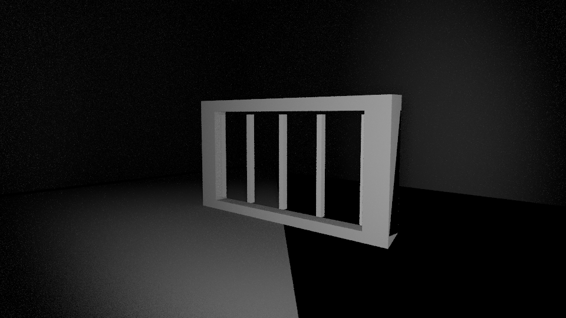
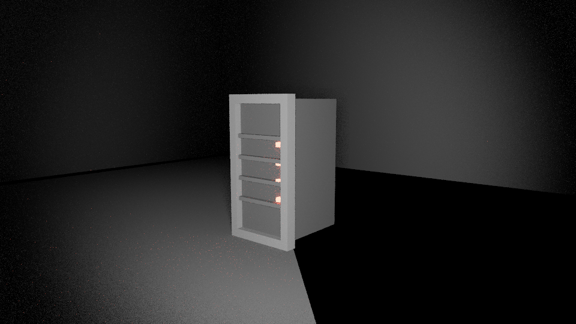
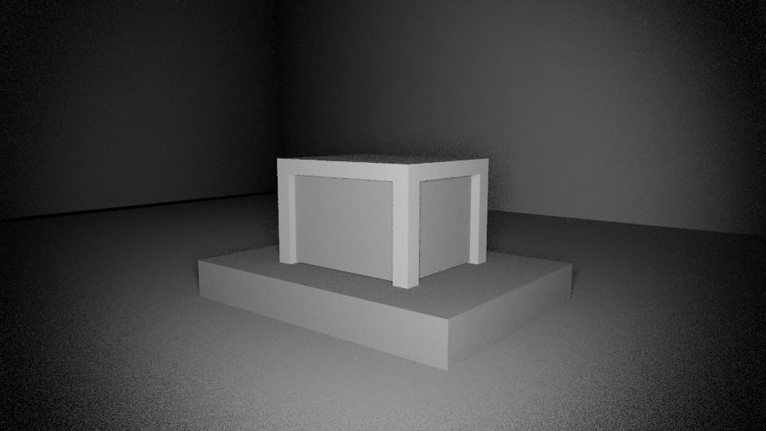
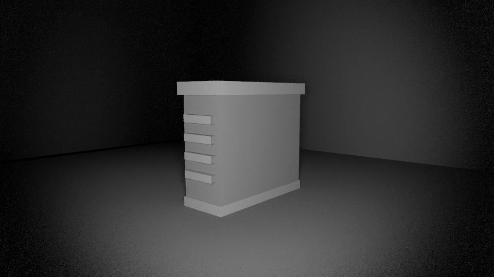

# Prefab Catalog

Genere le 2026-08-01 18:33:25.

Ce document rassemble le premier catalogue visuel des prefabs `scene v1` dans un seul Markdown.

Notes :
- chaque visuel est rendu par `liminal_cornell_renderer` a partir du `.scene` adjacent
- fond volontairement neutre en niveaux de gris
- le renderer n'expose pas encore de `color()` libre dans `scene v1`, donc pas de vrai fond vert catalogable a ce stade
- parametres de rendu utilises : `960x540`, `8` samples par pixel

## prefab_gate

Portail de seuil controle, utile pour les entrees, grilles et sas.

Source scene : `generated/prefab_catalog/scenes/prefab_gate.scene`



Directive rendue :

```text
prefab_gate "catalog_gate" pos(0.0,1.55,0.0) size(6.15,3.10,0.40) gray(0.46) detail(0.58) bars(5)
```

## prefab_rack

Baie serveur ou rack technique. Le renderer y injecte automatiquement des LEDs rouges.

Source scene : `generated/prefab_catalog/scenes/prefab_rack.scene`



Directive rendue :

```text
prefab_rack "catalog_rack" pos(0.0,1.25,0.0) size(1.30,2.50,1.60) gray(0.19) detail(0.35)
```

## prefab_crate

Caisse, bloc de service ou console basse pour meubler une salle et ajouter des prises d'action.

Source scene : `generated/prefab_catalog/scenes/prefab_crate.scene`



Directive rendue :

```text
prefab_crate "catalog_crate" pos(0.0,0.95,0.0) size(1.70,1.10,1.40) gray(0.20) detail(0.31)
```

## prefab_cooling_unit

Bloc de climatisation ou masse technique pour fixer une silhouette industrielle stable.

Source scene : `generated/prefab_catalog/scenes/prefab_cooling_unit.scene`



Directive rendue :

```text
prefab_cooling_unit "catalog_cooling_unit" pos(0.0,1.35,0.0) size(1.20,2.70,3.10) gray(0.25) detail(0.37)
```
