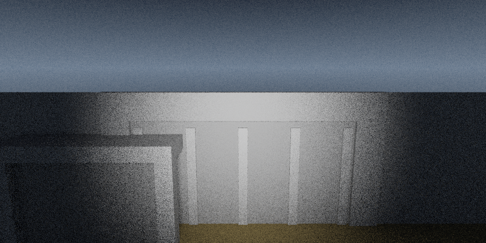
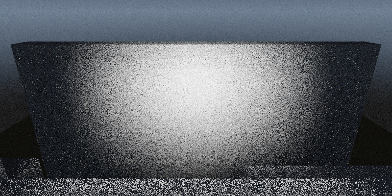
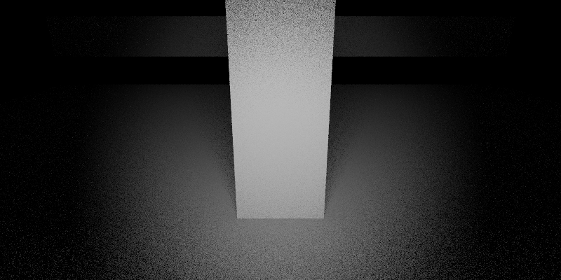
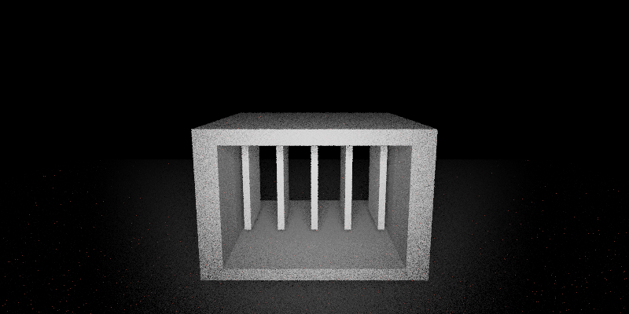
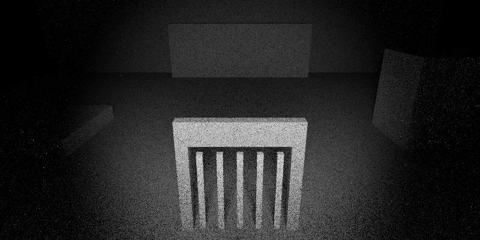
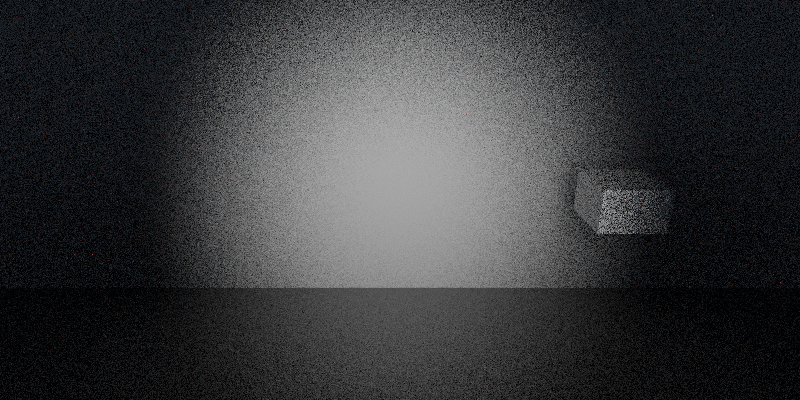
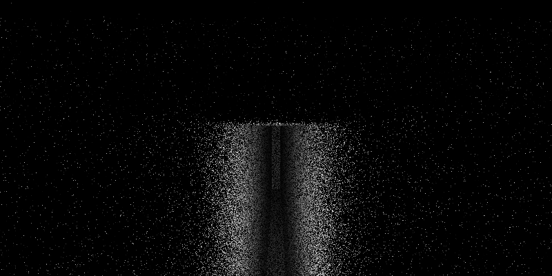
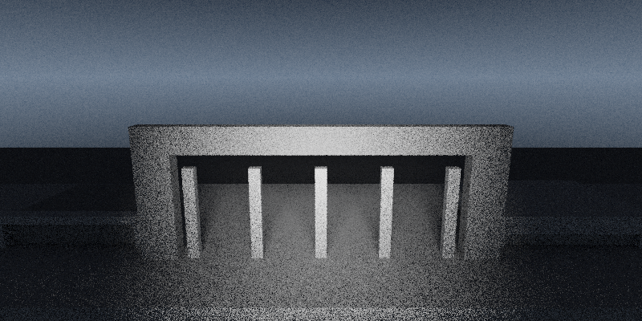

# Scene Generation Benchmark

Genere le 2026-08-02 08:53:12.

Ce document audite la generation directe de `.scene` par `Ministral` a partir de briefs spatiaux fixes.

Pipeline :
- le moteur fabrique le prompt exact via `--dump-scene-audit-prompt`
- `llama-cli` genere une reponse brute
- la reponse est normalisee en `.scene`
- le renderer audite le fichier et produit une image si la scene est valide

Parametres :
- rendu : `800x400`, `8` spp, `3` bounces, `1` direct samples
- LLM : `temperature=0.0`, `n_predict=1024`, `ctx=4096`, `seed=42`

Resultat global : `9/10` scenes valides, `1` invalides.

| Case | Status | Gen ms | Audit ms | Triangles | Materials |
| --- | --- | ---: | ---: | ---: | ---: |
| `entry_gate_dusk` | `valid` | 17970.32 | 462.28 | 220 | 20 |
| `sally_port_checkpoint` | `valid` | 21264.78 | 595.13 | 518 | 44 |
| `badge_vestibule` | `valid` | 21911.30 | 641.99 | 276 | 28 |
| `server_aisles_dense` | `valid` | 23490.59 | 623.22 | 1240 | 105 |
| `control_hub` | `valid` | 18984.96 | 577.93 | 166 | 18 |
| `backup_vault` | `valid` | 24408.34 | 798.83 | 772 | 66 |
| `cooling_exchange_bay` | `valid` | 27164.59 | 995.67 | 736 | 63 |
| `loading_dock_dust` | `invalid_scene` | 21338.12 | 104.25 | 0 | 0 |
| `roof_watch_dusk` | `valid` | 20129.25 | 587.23 | 410 | 35 |
| `stairhead_parapet` | `valid` | 20316.05 | 514.02 | 378 | 34 |

## Entry Gate

A concrete gate court faces the datacenter threshold. Dust clings to the bars and the badge reader blinks beside a service intercom.

Status : `valid`
Slug : `entry_gate_dusk`
Generation : `17970.32 ms`
Audit + render : `462.28 ms`
Scene lines : `11`
Scene chars : `884`
Triangles : `220`
Materials : `20`

State : `generated/scene_generation_benchmark/states/entry_gate_dusk.session.json`
Prompt : `generated/scene_generation_benchmark/prompts/entry_gate_dusk.prompt.txt`
Raw response : `generated/scene_generation_benchmark/responses/entry_gate_dusk.raw.txt`
Scene : `generated/scene_generation_benchmark/scenes/entry_gate_dusk.scene`
Audit stdout : `generated/scene_generation_benchmark/logs/entry_gate_dusk.audit.stdout.txt`
Audit stderr : `generated/scene_generation_benchmark/logs/entry_gate_dusk.audit.stderr.txt`

Spatial brief :
- location_id: `gate`
- location_archetype: `threshold courtyard`
- time_of_day: `dusk`
- visibility_level: `clear`
- desert_state: `still`
- interior_density: `sparse`
- alert_level: `1`
- anchors: `gate frame, perimeter wall, badge reader, intercom plate`
- visible_objects: `badge reader, service intercom, warning placard, padlocked crate`
- blocked_exits: `west, south`
- spatial_anomalies: `(none)`



## Sally Port Checkpoint

A narrow checkpoint sits between two heavy gates. A code keypad, a dead camera head, and a steel cabinet make the space feel procedural and exposed.

Status : `valid`
Slug : `sally_port_checkpoint`
Generation : `21264.78 ms`
Audit + render : `595.13 ms`
Scene lines : `15`
Scene chars : `1116`
Triangles : `518`
Materials : `44`

State : `generated/scene_generation_benchmark/states/sally_port_checkpoint.session.json`
Prompt : `generated/scene_generation_benchmark/prompts/sally_port_checkpoint.prompt.txt`
Raw response : `generated/scene_generation_benchmark/responses/sally_port_checkpoint.raw.txt`
Scene : `generated/scene_generation_benchmark/scenes/sally_port_checkpoint.scene`
Audit stdout : `generated/scene_generation_benchmark/logs/sally_port_checkpoint.audit.stdout.txt`
Audit stderr : `generated/scene_generation_benchmark/logs/sally_port_checkpoint.audit.stderr.txt`

Spatial brief :
- location_id: `unknown`
- location_archetype: `security checkpoint`
- time_of_day: `night`
- visibility_level: `low`
- desert_state: `windy`
- interior_density: `sparse`
- alert_level: `2`
- anchors: `inner gate, outer gate, checkpoint alcove`
- visible_objects: `code keypad, steel cabinet, dead camera head, inspection hatch`
- blocked_exits: `south`
- spatial_anomalies: `camera loop stuck on static`



## Badge Vestibule

A bare vestibule buffers the exterior from the datacenter core. The only relief is a reader column, a maintenance hatch, and a wall placard with faded rules.

Status : `valid`
Slug : `badge_vestibule`
Generation : `21911.30 ms`
Audit + render : `641.99 ms`
Scene lines : `15`
Scene chars : `1124`
Triangles : `276`
Materials : `28`

State : `generated/scene_generation_benchmark/states/badge_vestibule.session.json`
Prompt : `generated/scene_generation_benchmark/prompts/badge_vestibule.prompt.txt`
Raw response : `generated/scene_generation_benchmark/responses/badge_vestibule.raw.txt`
Scene : `generated/scene_generation_benchmark/scenes/badge_vestibule.scene`
Audit stdout : `generated/scene_generation_benchmark/logs/badge_vestibule.audit.stdout.txt`
Audit stderr : `generated/scene_generation_benchmark/logs/badge_vestibule.audit.stderr.txt`

Spatial brief :
- location_id: `unknown`
- location_archetype: `airlock vestibule`
- time_of_day: `night`
- visibility_level: `clear`
- desert_state: `still`
- interior_density: `sparse`
- alert_level: `1`
- anchors: `reader column, inner door, outer door`
- visible_objects: `badge reader, maintenance hatch, wall placard, ceiling speaker`
- blocked_exits: `west`
- spatial_anomalies: `(none)`



## Primary Server Aisles

Dense aisles of racks run into darkness. A service cart, a floor hatch, and a side console break the repetition under red LEDs.

Status : `valid`
Slug : `server_aisles_dense`
Generation : `23490.59 ms`
Audit + render : `623.22 ms`
Scene lines : `16`
Scene chars : `1251`
Triangles : `1240`
Materials : `105`

State : `generated/scene_generation_benchmark/states/server_aisles_dense.session.json`
Prompt : `generated/scene_generation_benchmark/prompts/server_aisles_dense.prompt.txt`
Raw response : `generated/scene_generation_benchmark/responses/server_aisles_dense.raw.txt`
Scene : `generated/scene_generation_benchmark/scenes/server_aisles_dense.scene`
Audit stdout : `generated/scene_generation_benchmark/logs/server_aisles_dense.audit.stdout.txt`
Audit stderr : `generated/scene_generation_benchmark/logs/server_aisles_dense.audit.stderr.txt`

Spatial brief :
- location_id: `server_aisles`
- location_archetype: `server aisles`
- time_of_day: `night`
- visibility_level: `low`
- desert_state: `still`
- interior_density: `dense`
- alert_level: `2`
- anchors: `rack corridor, service lane, ceiling cable tray`
- visible_objects: `service cart, floor hatch, side console, sealed lockbox`
- blocked_exits: `south`
- spatial_anomalies: `cooling hum pulses unevenly`



## Sector Control Hub

A compact control room opens off the aisles. One main console dominates the center while a locked cabinet and an access hatch wait at the margins.

Status : `valid`
Slug : `control_hub`
Generation : `18984.96 ms`
Audit + render : `577.93 ms`
Scene lines : `13`
Scene chars : `937`
Triangles : `166`
Materials : `18`

State : `generated/scene_generation_benchmark/states/control_hub.session.json`
Prompt : `generated/scene_generation_benchmark/prompts/control_hub.prompt.txt`
Raw response : `generated/scene_generation_benchmark/responses/control_hub.raw.txt`
Scene : `generated/scene_generation_benchmark/scenes/control_hub.scene`
Audit stdout : `generated/scene_generation_benchmark/logs/control_hub.audit.stdout.txt`
Audit stderr : `generated/scene_generation_benchmark/logs/control_hub.audit.stderr.txt`

Spatial brief :
- location_id: `unknown`
- location_archetype: `control room`
- time_of_day: `night`
- visibility_level: `clear`
- desert_state: `still`
- interior_density: `sparse`
- alert_level: `2`
- anchors: `main console, wall cabinet, floor hatch`
- visible_objects: `main console, locked cabinet, floor hatch, status placard`
- blocked_exits: `east, south`
- spatial_anomalies: `(none)`



## Backup Vault

A chilled storage vault holds sealed pods and backup racks. A biometric pad, a wheeled crate, and a suspended service panel suggest expensive access.

Status : `valid`
Slug : `backup_vault`
Generation : `24408.34 ms`
Audit + render : `798.83 ms`
Scene lines : `17`
Scene chars : `1348`
Triangles : `772`
Materials : `66`

State : `generated/scene_generation_benchmark/states/backup_vault.session.json`
Prompt : `generated/scene_generation_benchmark/prompts/backup_vault.prompt.txt`
Raw response : `generated/scene_generation_benchmark/responses/backup_vault.raw.txt`
Scene : `generated/scene_generation_benchmark/scenes/backup_vault.scene`
Audit stdout : `generated/scene_generation_benchmark/logs/backup_vault.audit.stdout.txt`
Audit stderr : `generated/scene_generation_benchmark/logs/backup_vault.audit.stderr.txt`

Spatial brief :
- location_id: `unknown`
- location_archetype: `backup vault`
- time_of_day: `night`
- visibility_level: `low`
- desert_state: `still`
- interior_density: `dense`
- alert_level: `3`
- anchors: `sealed data pods, vault door, service panel`
- visible_objects: `biometric pad, wheeled crate, service panel, emergency switch`
- blocked_exits: `north, west`
- spatial_anomalies: `cold vapor drifts near the floor`



## Cooling Exchange Bay

Tall cooling blocks and pipe runs crowd an industrial chamber. A valve wheel, a drip tray, and a maintenance console provide the room's few obvious handles.

Status : `valid`
Slug : `cooling_exchange_bay`
Generation : `27164.59 ms`
Audit + render : `995.67 ms`
Scene lines : `19`
Scene chars : `1511`
Triangles : `736`
Materials : `63`

State : `generated/scene_generation_benchmark/states/cooling_exchange_bay.session.json`
Prompt : `generated/scene_generation_benchmark/prompts/cooling_exchange_bay.prompt.txt`
Raw response : `generated/scene_generation_benchmark/responses/cooling_exchange_bay.raw.txt`
Scene : `generated/scene_generation_benchmark/scenes/cooling_exchange_bay.scene`
Audit stdout : `generated/scene_generation_benchmark/logs/cooling_exchange_bay.audit.stdout.txt`
Audit stderr : `generated/scene_generation_benchmark/logs/cooling_exchange_bay.audit.stderr.txt`

Spatial brief :
- location_id: `unknown`
- location_archetype: `cooling plant bay`
- time_of_day: `night`
- visibility_level: `dusty`
- desert_state: `still`
- interior_density: `dense`
- alert_level: `2`
- anchors: `cooling blocks, pipe gallery, drain trench`
- visible_objects: `valve wheel, maintenance console, drip tray, tool locker`
- blocked_exits: `west`
- spatial_anomalies: `one pipe bank rattles under strain`



## Dust Loading Dock

A side loading bay opens toward the desert through a half-raised shutter. Pallets, a cargo crate, and a bent lamp post stage a tense threshold between inside and outside.

Status : `invalid_scene`
Slug : `loading_dock_dust`
Generation : `21338.12 ms`
Audit + render : `104.25 ms`
Scene lines : `14`
Scene chars : `1103`
Triangles : `0`
Materials : `0`

State : `generated/scene_generation_benchmark/states/loading_dock_dust.session.json`
Prompt : `generated/scene_generation_benchmark/prompts/loading_dock_dust.prompt.txt`
Raw response : `generated/scene_generation_benchmark/responses/loading_dock_dust.raw.txt`
Scene : `generated/scene_generation_benchmark/scenes/loading_dock_dust.scene`
Audit stdout : `generated/scene_generation_benchmark/logs/loading_dock_dust.audit.stdout.txt`
Audit stderr : `generated/scene_generation_benchmark/logs/loading_dock_dust.audit.stderr.txt`

Spatial brief :
- location_id: `unknown`
- location_archetype: `loading dock`
- time_of_day: `dusk`
- visibility_level: `dusty`
- desert_state: `dusty`
- interior_density: `sparse`
- alert_level: `2`
- anchors: `half-raised shutter, dock lip, desert threshold`
- visible_objects: `cargo crate, shipping placard, control switch, lamp post`
- blocked_exits: `north`
- spatial_anomalies: `dust slips under the shutter in thin sheets`

Erreur :

```text
C:\works\projects\game-liminal-raytraced-llm-world\documentation\generated\scene_generation_benchmark\scenes\loading_dock_dust.scene:8: prefab_gate requires name, pos(), size(), and gray()
```

## Roof Watch

The datacenter roof becomes a parapet walk above the desert. A beacon mast, a hatch door, and a field scope hold the line against the horizon.

Status : `valid`
Slug : `roof_watch_dusk`
Generation : `20129.25 ms`
Audit + render : `587.23 ms`
Scene lines : `13`
Scene chars : `1012`
Triangles : `410`
Materials : `35`

State : `generated/scene_generation_benchmark/states/roof_watch_dusk.session.json`
Prompt : `generated/scene_generation_benchmark/prompts/roof_watch_dusk.prompt.txt`
Raw response : `generated/scene_generation_benchmark/responses/roof_watch_dusk.raw.txt`
Scene : `generated/scene_generation_benchmark/scenes/roof_watch_dusk.scene`
Audit stdout : `generated/scene_generation_benchmark/logs/roof_watch_dusk.audit.stdout.txt`
Audit stderr : `generated/scene_generation_benchmark/logs/roof_watch_dusk.audit.stderr.txt`

Spatial brief :
- location_id: `roof_watch`
- location_archetype: `roof parapet`
- time_of_day: `dusk`
- visibility_level: `clear`
- desert_state: `windy`
- interior_density: `sparse`
- alert_level: `1`
- anchors: `parapet, horizon, beacon mast, roof hatch`
- visible_objects: `roof hatch, field scope, beacon mast switch, warning sign`
- blocked_exits: `south`
- spatial_anomalies: `(none)`


## Parapet Stairhead

A concrete stairhead interrupts the roof line. The landing is tight, with a latch box, a cable spool, and a narrow gate looking over the darkening desert.

Status : `valid`
Slug : `stairhead_parapet`
Generation : `20316.05 ms`
Audit + render : `514.02 ms`
Scene lines : `13`
Scene chars : `1021`
Triangles : `378`
Materials : `34`

State : `generated/scene_generation_benchmark/states/stairhead_parapet.session.json`
Prompt : `generated/scene_generation_benchmark/prompts/stairhead_parapet.prompt.txt`
Raw response : `generated/scene_generation_benchmark/responses/stairhead_parapet.raw.txt`
Scene : `generated/scene_generation_benchmark/scenes/stairhead_parapet.scene`
Audit stdout : `generated/scene_generation_benchmark/logs/stairhead_parapet.audit.stdout.txt`
Audit stderr : `generated/scene_generation_benchmark/logs/stairhead_parapet.audit.stderr.txt`

Spatial brief :
- location_id: `unknown`
- location_archetype: `roof stairhead`
- time_of_day: `dusk`
- visibility_level: `low`
- desert_state: `windy`
- interior_density: `sparse`
- alert_level: `1`
- anchors: `stairhead bulk, roof gate, parapet edge`
- visible_objects: `latch box, cable spool, roof gate handle, inspection placard`
- blocked_exits: `east, south`
- spatial_anomalies: `wind makes the gate vibrate softly`


